[TOC]

# 操作系统

## 用户态和内核态之间的切换

**用户态->内核态**

1. 系统调用
2. 强迫中断，包括硬件故障如缺页中断；还有软件中断如处以0；
3. 外中断

**内核态->用户态**


## 线程可以控制进程吗？进程可以控制线程吗

* 进程是线程的容器，一个进程包括多个进程。


## 协程
>[【面试高频问题】线程、进程、协程](https://zhuanlan.zhihu.com/p/70256971)

## 进程和线程的区别与联系

## 为什么线程更轻量级？
线程创建/销毁开销小；进程创建/销毁开销大

- 创建/撤销进程时，系统都要为之分配/回收资源（内存空间、I/O设备等），进程间切换涉及当前执行进程CPU环境保存即新调度进程CPU环境的设置
- 每个线程都有自己独立的运行栈和程序计数器，线程切换只需保存和设置少量寄存器内容，开销小

## 为什么切换进程的代价比切换线程大

## 进程与线程是否有独立地址空间
* 系统在运行的时候会为每个进程分配不同的内存空间，每个进程都有独立的代码和数据空间
* 线程可以看作轻量级的进程，除了CPU之外，系统不会为线程分配内存，同一进程下的线程共享代码和数据空间。

## 进程间的通信
> [进程间的五种通信方式介绍](https://www.cnblogs.com/zgq0/p/8780893.html)
>
> [面试必问：七大进程间通信和线程同步](https://www.nowcoder.com/discuss/443829?channel=1009&source_id=home_feed)

指在不同进程之间传播或交换信息
* 管道【包括无名管道、命名通道】

* 消息队列
* 信号量
* 共享内存
* 信号
* 套接字

### 管道【无名通道 命名通道】
管道是一种半双工的通信方式，**数据只能单向流动**，管道是一个固定大小的缓冲区。在Linux中，该缓冲区的大小为1页，即4K字节。从管道读数据是一次性操作，数据一旦被读，它就从管道中被抛弃。
**无名通道** 只能在具有血缘关系的进程间使用。
**命名通道** 允许无亲缘关系进程间通信。

### 消息队列
消息队列是由消息组成的链表，存放在内核中并由消息队列标识符标识。
消息队列克服了信号传递消息少，管道只能承载无格式字节流以及缓冲区大小受限等缺点。
消息队列与管道通信相比，其优势是对每个消息指定特定的消息类型，接受的时候不需要按照队列次序，而是可以根据自定义条件特定类型的消息。

### 信号量
信号量是一个计数器，信号量用于实现进程间的互斥与同步，而不是用于存储进程间通信数据。信号量基于操作系统的 PV 操作，程序对信号量的操作都是原子操作。每次对信号量的 PV 操作不仅限于对信号量值+1或-1，而且可以加减任意正整数。
### 信号
信号是一种比较复杂的通信方式，用于通知接收进程某一事件已经发生。

### 共享内存
共享内存就是映射一段能被其他进程所访问的内存，这段共享内存由一个进程创建，但多个进程都可以访问，**共享内存是最快的IPC方式**，它是针对其他进程间的通信方式运行效率低而专门设计。它往往与其他通信机制，如信号量配合使用，来实现进程间的同步和通信。
### 套接字


## 进程间互斥的锁

## 实现多线程的方式？

## 同步异步串行并发
>[并发、并行、串行、同步、异步的区别？](https://blog.csdn.net/qq_41610418/article/details/86647967)

## CPU上下文切换
>[一文让你明白CPU上下文切换](https://zhuanlan.zhihu.com/p/52845869)

### 什么是CPU上下文

**CPU 寄存器**和**程序计数器**就是 CPU 上下文，因为它们都是 CPU 在运行任何任务前，必须的依赖环境。


* **CPU 寄存器** 是 CPU 内置的容量小、但速度极快的内存。
* **程序计数器** 则是用来存储 CPU 正在执行的指令位置、或者即将执行的下一条指令位置。

### 什么是CPU上下文切换
就是先把前一个任务的 CPU 上下文（也就是 CPU 寄存器和程序计数器）保存起来，然后加载新任务的上下文到这些寄存器和程序计数器，最后再跳转到程序计数器所指的新位置，运行新任务。而这些保存下来的上下文，会存储在系统内核中，并在任务重新调度执行时再次加载进来。这样就能保证任务原来的状态不受影响，让任务看起来还是连续运行。

进程既可以在用户空间运行，又可以在内核空间中运行。进程在用户空间运行时，被称为进程的用户态，而陷入内核空间的时候，被称为进程的内核态。
### 进程上下文切换

**进程上下文切换过程**
1. 保存当前进程的虚拟内存、栈、全局变量等
2. 保存内核状态和CPU寄存器
3. 加载下一进程的内核态
4. 刷新新进程的虚拟内存和用户栈


**系统调用过程**
1. 保存CPU寄存器原来用户态的指令位置，将CPU寄存器更新为内核态指令的新位置；
2. 跳转到内核态运行内核任务；
3. 系统调用结束，CPU寄存器恢复原来用户保存的状态，切换到用户空间，继续运行进程


**进程切换vs系统调用**
* 进程上下文切换，是指从一个进程切换到另一个进程运行。
* 系统调用过程中一直是同一个进程在运行【系统调用过程通常称为特权模式切换】
* **进程的上下文切换就比系统调用时多了一步：在保存内核态资源（当前进程的内核状态和 CPU 寄存器）之前，需要先把该进程的用户态资源（虚拟内存、栈等）保存下来；而加载了下一进程的内核态后，还需要刷新进程的虚拟内存和用户栈。**

> 保存上下文和恢复上下文的过程并不是“免费”的，需要内核在 CPU 上运行才能完成。
>
> 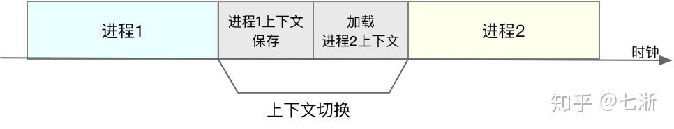


**发生上下文切换的场景**
1. 为了保证所有进程可以得到公平调度，CPU 时间被划分为一段段的时间片，这些时间片再被轮流分配给各个进程。这样，当某个进程的时间片耗尽了，就会被系统挂起，切换到其它正在等待 CPU 的进程运行。
2. 进程在系统资源不足（比如内存不足）时，要等到资源满足后才可以运行，这个时候进程也会被挂起，并由系统调度其他进程运行。
3. 当进程通过睡眠函数 sleep 这样的方法将自己主动挂起时，自然也会重新调度。
4. 当有优先级更高的进程运行时，为了保证高优先级进程的运行，当前进程会被挂起，由高优先级进程来运行。
5. 发生硬件中断时，CPU 上的进程会被中断挂起，转而执行内核中的中断服务程序。
### 线程上下文切换

**发生线程上下文切换的场景**

1. 前后两个线程属于不同进程。此时，因为资源不共享，所以切换过程就跟进程上下文切换是一样。
2. 

### 中断上下文切换
为了快速响应硬件的事件，**中断处理会打断进程的正常调度和执行，转而调用中断处理程序，响应设备事件**。而在打断其他进程时，就需要将进程当前的状态保存下来，这样在中断结束后，进程仍然可以从原来的状态恢复运行。

**跟进程上下文切换不同，中断上下文切换并不涉及到进程的用户态**。所以，即便中断过程打断了一个正处在用户态的进程，也不需要保存和恢复这个进程的虚拟内存、全局变量等用户态资源。中断上下文，其实只包括内核态中断服务程序执行所必需的状态，包括 CPU 寄存器、内核堆栈、硬件中断参数等。

## 进程同步之信号量机制（pv操作）及三个经典同步问题
>[进程同步之信号量机制（pv操作）及三个经典同步问题](https://www.it610.com/article/1293407896628961280.htm)


### 信号量机制


### 生产者-消费者【缓冲区问题】
### 作者读者问题
### 哲学家进餐
为避免死锁，有以下方法：
1. 至多只允许四个哲学家同时进餐，以保证至少有一个哲学家能够进餐，最终总会释放他所使用过的两支筷子，从而使得更多的哲学家进餐。
```cpp
semaphore chopstick[5]={1,1,1,1,1};
semaphore count=4; // 设置一个count，最多有四个哲学家可以进来
void philosopher(int i)
{
// 为什么需要 while(true) 因为不是吃一次就不吃了
	while(true)
	{
		think();
		wait(count); //请求进入房间进餐 当count为0时 不能允许哲学家再进来了
		wait(chopstick[i]); //请求左手边的筷子
		wait(chopstick[(i+1)%5]); //请求右手边的筷子
		eat();
		signal(chopstick[i]); //释放左手边的筷子
		signal(chopstick[(i+1)%5]); //释放右手边的筷子
		signal(count); //离开饭桌释放信号量
	}
}

```
philosopher(i) 表示按照某一种标序号的方式，第i个哲学家开始吃

2. 仅当哲学家的左右两支筷子都可用时，才允许他拿起筷子进餐。
**实现方式一**：
```cpp

semaphore chopstick[5]={1，1，1，1，1}; 
void philosopher(int I) 
{ 
        while(true) 
        { 
                think(); 
                wait(chopstick[(I+1)]%5,chopstick[I]); 
                eat(); 
                signal(chopstick[(I+1)]%5,chopstick[I]); 
        } 
} 
```
利用AND 型信号量机制实现：根据课程讲述，在一个原语中，将一段代码同时需要的多个临界资源，要么全部分配给它，要么一个都不分配，因此不会出现死锁的情形。当某些资源不够时阻塞调用进程;由于等待队列的存在，使得对资源的请求满足FIFO 的要求，因此不会出现**饥饿**的情形。

**实现方式二**：
```cpp

semaphore mutex = 1 ; 
semaphore chopstick[5]={1，1，1，1，1}; 
void philosopher(int I) 
{ 
        while(true) 
        { 
                think(); 
                wait(mutex); 
                wait(chopstick[(I+1)]%5); 
                wait(chopstick[I]); 
                signal(mutex); 
                eat(); 
                signal(chopstick[(I+1)]%5); 
                signal(chopstick[I]); 
        } 
} 
```


利用信号量的保护机制实现。通过信号量mutex对eat（）之前的取左侧和右侧筷子的操作进行保护，使之成为一个原子操作，这样可以防止死锁的出现。

3. 规定奇数号的哲学家先拿起他左边的筷子,然后再去拿他右边的筷子;而偶数号的哲学家则相反.按此规定,将是1,2号哲学家竞争1号筷子,3,4号哲学家竞争3号筷子.即五个哲学家都竞争奇数号筷子,获得后,再去竞争偶数号筷子,最后总会有一个哲学家能获得两支筷子而进餐。而申请不到的哲学家进入阻塞等待队列，根FIFO原则，则先申请的哲学家会较先可以吃饭，因此不会出现饿死的哲学家。

```cpp

semaphore chopstick[5]={1，1，1，1，1}; 
void philosopher(int i) 
{ 
        while(true) 
        { 
                think(); 
                if(i%2 == 0) //偶数哲学家，先右后左。 
                { 
                        wait (chopstick[ i + 1 ] mod 5) ; 
                        wait (chopstick[ i]) ; 
                        eat(); 
                        signal (chopstick[ i + 1 ] mod 5) ; 
                        signal (chopstick[ i]) ; 
                } 
                else //奇数哲学家，先左后右。 
                { 
                        wait (chopstick[ i]) ; 
                        wait (chopstick[ i + 1 ] mod 5) ; 
                        eat(); 
                        signal (chopstick[ i]) ; 
                        signal (chopstick[ i + 1 ] mod 5) ; 
                } 
        } 
}
```

## 线程安全
>[如果你这样回答“什么是线程安全”，面试官都会对你刮目相看](https://zhuanlan.zhihu.com/p/67905621)

### 定义
线程安全就是确保程序在多线程运行的情况下，程序能够按照预期运行，不会存在二义性的结果。

### 原因
线程安全不是指线程的安全，而是指内存的安全。
目前主流操作系统都是多任务的，即多个进程同时运行。为了保证安全，每个进程只能访问分配给自己的内存空间，而不能访问别的进程的，**这是由操作系统保障的**。

在每个进程的内存空间中都有一块特殊的公共区域，通常称为堆（内存）。进程内的所有线程都可以访问到该区域，这就是造成问题的潜在原因。

即堆内存空间在没有保护机制的情况下，对多线程来说是不安全的地方。

### 解决方案
1. 每个线程有独立的内存空间，通常称为栈内存。【局部变量】
2. 共享区域的数据根据线程数复制一遍。
3. 加上只读标志【共享资源，比如磁盘，只能读取数据】
4. 加互斥锁【只允许一个线程拥有对共享资源的独占】
>[C++多线程编程入门之经典实例](http://www.jizhuomi.com/software/287.html?utm_source=tuicool)
```cpp
#include <iostream>
#include <windows.h>
using namespace std;

HANDLE hMutex;

DWORD WINAPI Fun(LPVOID lpParamter)
{
       while(1) {
                 WaitForSingleObject(hMutex, INFINITE);
                 cout<<"Fun display!"<<endl;
                 Sleep(1000);
                 ReleaseMutex(hMutex);
        }
}

int main()
{
      HANDLE hThread = CreateThread(NULL, 0, Fun, NULL, 0, NULL);
      hMutex = CreateMutex(NULL, FALSE, "screen");
      CloseHandle(hThread);
      while(1) {
               WaitForSingleObject(hMutex, INFINITE);
               cout<<"main display!"<<endl;
               Sleep(2000);
               ReleaseMutex(hMutex);
      }

      return 0;
}

```


## 线程同步
### 什么叫线程同步
线程同步指的是同一进程中的多个进程相互协调工作从而达到一致性。之所以需要线程同步，因为多个线程同时对一个数据对象进行修改操作时，可能会对数据造成破坏。

### 线程如何同步

- 临界区
- 互斥量
- 信号量
## 线程通信？？
>[线程之间的通信](https://www.cnblogs.com/xiaowangbangzhu/p/10443103.html)
>[线程安全、线程同步、线程间通信](https://blog.csdn.net/weixin_42201566/article/details/83933938)
>[c++线程同步和通信](https://blog.csdn.net/weixin_30710457/article/details/98935757)

- 事件 wait/notify


## 互斥锁和自旋锁的区别
>[互斥锁和自旋锁的区别](https://www.cnblogs.com/LiuYanYGZ/p/12739614.html)

**互斥锁 同步锁 临界区 互斥量 信号量 自旋锁**
互斥量和信号量本质上一样，都是用来表示对资源的访问权，但是互斥量表示资源某个时刻最多只能被一个线程占用，也就是资源计数最多为1，而信号量的资源计数可以超过1，即同时被多个线程占用。

>不管是信号量还是互斥量，线程在等待的时候会从用户态进入内核态，从而不再占用cpu时间，当获得该信号量或互斥量的访问权时，再由OS调度回用户态，由于上下文切换以及调度算法等原因，总的来说开销比较大，对性能会有损耗
>信号量在整个系统可以被任意线程获取并释放，也就是说，同一个信号量可以被系统中的一个线程获取之后由另一个线程释放。而互斥量则要求哪个线程获取了互斥量，哪个线程就要负责释放，其他线程去释放互斥量是无效的

自旋锁通过循环判断锁是否被释放，不会放弃CPU时间进入内核态，因此比较快速，但是因为占用CPU时间，所以一般只有在发生同步概率很低的时候才会使用自旋锁

临界区表示某个资源同一时刻只能被一个线程占用，区别在于性能，关键段的性能要优于互斥量，它的原理是先自旋一段时间，如果等不到资源再进入内核态。
>互斥量和信号量在系统的任何进程里都是可见的，也就是说，一个进程创建了一个信号量或互斥量，另一个进程试图去获取该锁是合法的。然而，临界区的作用范围仅限于本进程，其他进程无法获取该锁。

## 内存管理
### 在段页机制下，cpu访问内存需要几次
**3次**
第一次查段表；第二次查页表；第三次访问目标单元

优化方案：可引入快表机制，以段号和页号为关键字查询快表，即可直接找到最终的目标页面存放位置。引入快表后仅需访问一次内存。
## 僵尸进程 vs 孤儿进程

>[服务器进程为何通常fork()两次
>
>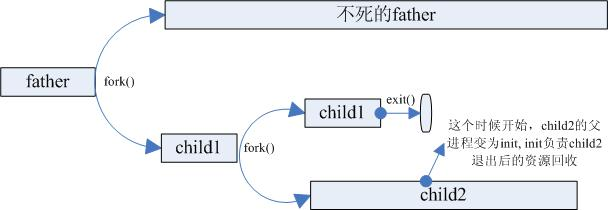

为什么child1变成了init进程呢??
### 分页技术

分页是为了解决内存连续分配时产生的碎片问题，分页之后，页表逻辑上是连续的，物理上不连续。【只存在外碎片，不存在页内碎片】表面上看每一页大小越小，碎片会变少，但是需要的页表大小会增加很多。

# 计算机网络

## 一个数据包在网络中的心路历程

[【面试必备】探究！一个数据包在网络中的心路历程](https://www.nowcoder.com/discuss/383646?source_id=profile_create&channel=666)

### MAC

`MAC` 头部是以太网使用的头部，它包含了接受方和发送方的 `MAC` 地址等信息。在 `MAC` 包头里需要发送方 `MAC` 地址和 接受方目标 `MAC` 地址，用于 **两点之间的传输。**


一般在 `TCP/IP` 通信里， `MAC` 包头的协议类型只使用：

* 0800：IP协议
* 0806：ARP协议


#### 发送方和接受方 `MAC` 如何确认？

**发送方** 的 `MAC` 地址获取比较简单， `MAC` 地址在网卡生产时就写入`ROM` 里的，只要将这个值读取出来写入到 `MAC` 就可以了。

**接受方**的 `MAC` 地址获取方式如下：

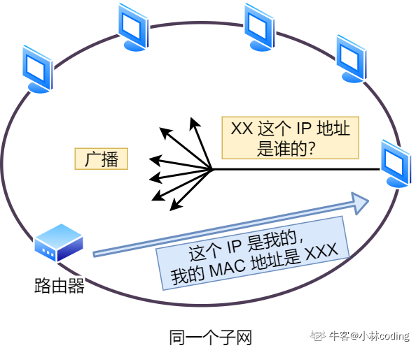

`ARP` 协议会在以太网中以 **广播** 的方式问询以太网中的所有设备，请拥有问询 `IP` 地址的设备返回其对应的 `MAC` 地址。

具体实现时，

* 路由器首先查询 `ARP` 缓存，如果其中已经保存了对方的 `MAC` 地址，就不需要发送 `ARP` 查询，直接使用 `ARP` 缓存中的地址。

* 而当 `ARP` 缓存中不存在对方 `MAC` 地址时，则发送 `ARP` 广播查询。
* 
* 
* **交换机** 根据 `MAC` 地址表查找 `MAC` 地址，然后将信号发送到响应的端口。

## IP地址

[IP基础知识全家桶，45张图一套带走](https://www.nowcoder.com/discuss/422305?source_id=profile_create&channel=666)

`IP` 的作用是在复杂的网络环境中将数据包发送给最终目的主机。

* `ipv4` 地址由 `32` 位整数来表示，`ip` 的最大值为 $2^{32}=4294967296$ ，也就是最大允许43亿台计算机连接到网络。**实际上， `IP` 地址并不是更加主机台数来配置的，而是以网卡**。

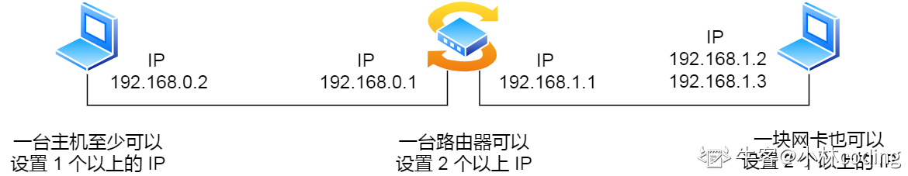

* `ip` 地址由 【网络标识】和【主机标识】组成。


上图中黄色部分为分类号，用以区分 `ip` 地址类别。

* `ipv6` 的地址是 `128` 位的，可分配的地址变多了
  * `ipv6` 可自动配置，即使没有 `DHCP` 服务器也可以实现自动分配 `ip` 地址。
  * `ipv6` 包头包首部长度采用固定的值 `40` 字节，去掉了包头校验和，简化了首部结构，减轻了路由器负荷，大大**提高了传输的性能。**
  * `ipv6` 有应对伪造 `IP` 地址的网络安全功能以及防止线路窃听的功能，大大 **提升了安全性**。
  * 

* 在 `ip` 地址中，有两个 `ip` 是特殊的，分别是 **主机号** 全为 `1` 和 全为 `0` 的地址。主机号全为 1 指定某个网络下的所有主机，用于广播；主机号全为 0 指定某个网络。**广播** 用于给同一链路中相互连接的主机之间发送数据包。


### IP地址和MAC地址之间的区别

* `IP` 的作用是主机之间通信的，负责在 `没有直连`  的两个网络之间进行通信传输；
* `MAC` 的作用则是实现`直连`的两个设备之间通信；

**网络数据包的传输过程中，源 `IP` 地址和目标 `IP` 地址在传输过程中是不会变化的，只有源 `MAC` 地址和 目标 `MAC` 地址一直在变化。**

### 为什么要分离网络号和主机号

因为两台计算机要通讯，首先要判断是否处于一个广播域内，即网络地址是否相同，如果网络地址相同，表明接受方在本网络上，那么可以把数据包直接发送到目标主机。路由器寻址工作中，也就是通过这样的方式来找到对应的网络号的，进而把数据包转发给对应的网络内。

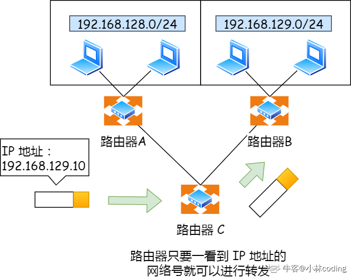

### 怎么进行子网划分

**公有IP和私有IP**

### ARP

在传输一个 `IP` 数据报的时候，确定了源 `IP` 地址和目标 `IP` 地址后，就会通过主机【路由器】确定 `IP` 数据包下一跳。然而，网络层的下一层是数据链路层，所以我们还需要知道下一跳的 `MAC` 地址，`ARP` 就是用来获知下一跳的地址。


### RARP

它是已知 `MAC` 地址求 `IP` 地址。它通过架设一台 `RARP` 服务器，在这个服务器上注册设备的 `MAC` 地址及其 `IP` 地址， 然后将这个设备接入网络。


## 域名解析
>[浅谈dns域名解析过程](https://zhuanlan.zhihu.com/p/58108010)

### 什么是域名
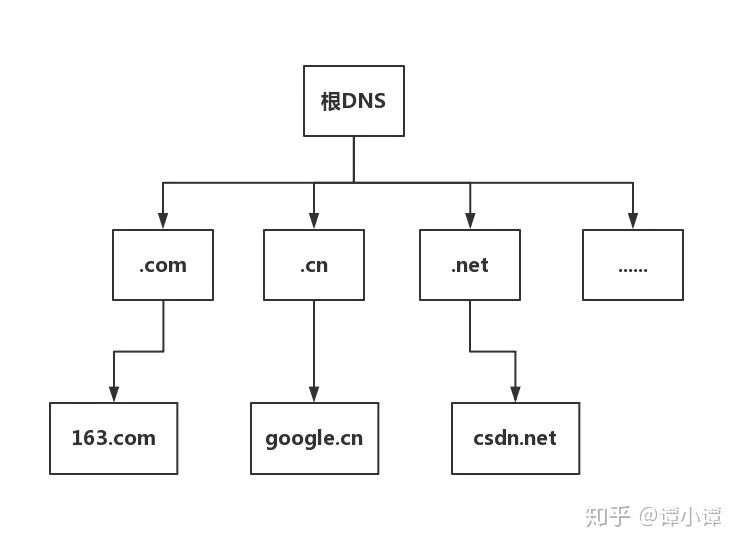

以 https://www.baidu.com

* . 是根域名
* .com 是顶级域名
* baidu.com 是次级域名


### DNS概念
### 域名解析过程
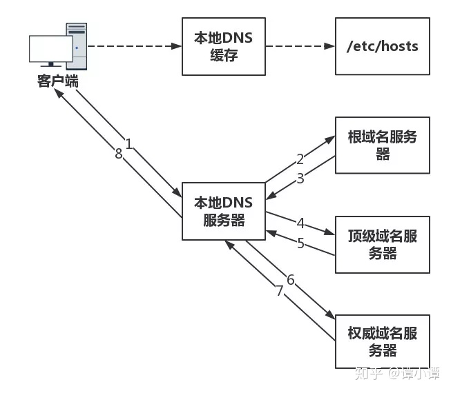

## HTTP和HTTPS
>[十分钟搞懂HTTP和HTTPS协议？](https://zhuanlan.zhihu.com/p/72616216)


### HTTP
>[HTTP 详解](https://blog.csdn.net/hguisu/article/details/8680808)

**定义：**
HTTP是一个基于TCP/IP通信协议来传递数据的协议，传输的数据类型为HTML文件、图片文件、查询结果等。

**特点：**
1. http协议支持客户端/服务端模式，也是一种请求/响应模式的协议。
2. 简单快速：客户向服务器请求服务时，只需传送请求方法和路径。请求方法常用的有GET、HEAD、POST。
3. 灵活：HTTP允许传输任意类型的数据对象。传输的类型由Content-Type加以标记。
4. 无连接：限制每次连接只处理一个请求。服务器处理完请求，并收到客户的应答后，即断开连接，但是却不利于客户端与服务器保持会话连接，**为了弥补这种不足，产生了两项记录http状态的技术，一个叫做Cookie,一个叫做Session。**
5. **无状态**：无状态是指协议对于事务处理没有记忆，后续处理需要前面的信息，则必须重传【客户机（Web浏览器）和服务器之间不需要建立持久的连接，这意味着当一个客户端向服务器发出请求，然后服务器返回相应，连接就被关闭了，在服务器端不保留连接的有关信息。】。
6. 请求信息明文传输。

#### HTTP常见的首部字段
>[HTTP常见的首部字段](https://blog.csdn.net/klh_bahk/article/details/88563611)

**请求报文格式**

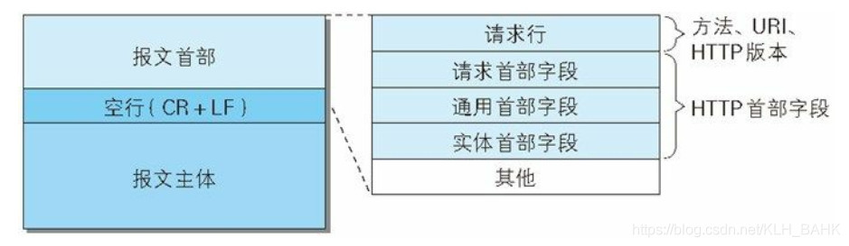

**响应报文格式**

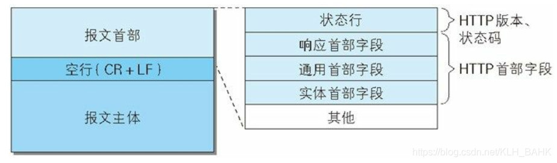

#### HTTP的工作过程【工作原理】

一次HTTP操作称为一个事务，其工作整个过程如下：
1. **地址解析**
 如用客户端浏览器请求这个页面：http://localhost.com:8080/index.htm
 从中分解出协议名、主机名、端口、对象路径等部分，对于我们的这个地址，解析得到的结果如下：
     协议名：http
     主机名：localhost.com
     端口：8080
     对象路径：/index.htm      
     在这一步，需要域名系统DNS解析域名localhost.com,得主机的IP地址。
2. **封装HTTP请求数据包**
将以上部分结合本机自己的信息，封装成一个HTTP请求数据包
3. **封装成TCP包，建立TCP连接（TCP的三次握手）**
4. **客户端发送请求命令**
5. **服务器处理请求并返回HTTP报文**
6. **浏览器解析渲染页面**
7. **关闭TCP连接**


#### HTTP协议栈中各层数据流

**客户机发起一次请求的时候**

客户机会将请求封装成http数据包-->封装成Tcp数据包-->封装成Ip数据包--->封装成数据帧--->硬件将帧数据转换成bit流（二进制数据）-->最后通过物理硬件（网卡芯片）发送到指定地点。       
服务器硬件首先收到bit流，然后转换成ip数据包。于是通过ip协议解析Ip数据包，然后又发现里面是tcp数据包，就通过tcp协议解析Tcp数据包，接着发现是http数据包通过http协议再解析http数据包得到数据。 

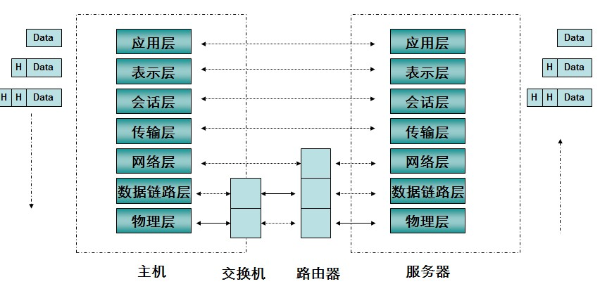

**从上往下看**，客户端发起请求时，数据在各层协议的数据组织：

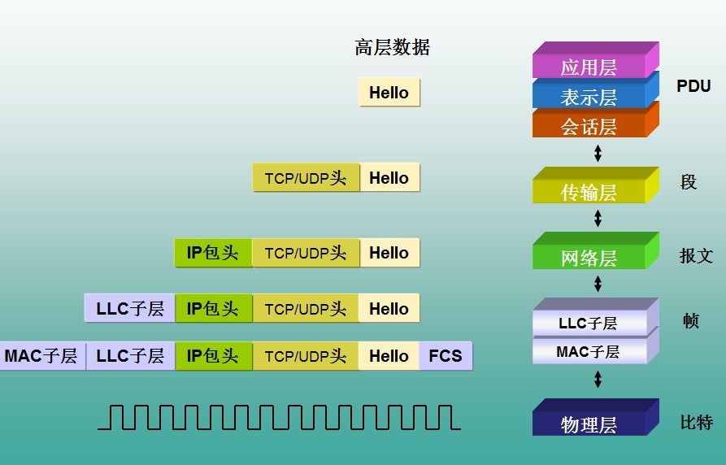


### HTTP请求头 and 响应头
HTTP的请求头指的是报文首部中的首部字段

#### 请求头

* `accept`：浏览器通过这个头告诉服务器，它所支持的数据类型。如：text/html, image/jpeg
* `accept-Charset`：浏览器通过这个头告诉服务器，它支持哪种字符集。
* `accept-encoding`：浏览器通过这个头告诉服务器，它支持哪种压缩格式。
* `accept-language`：浏览器通过这个头告诉服务器，它的语言环境。
* `host`：浏览器通过这个头告诉服务器，它想访问哪台主机。
* `if-modified-since`：浏览器通过这个头告诉服务器，缓存数据的时间
* `referer`：浏览器通过这个头告诉服务器，客户机是哪个页面来的(防盗链)。
* `Connection`：浏览器通过这个头告诉服务器，请求完后是断开链接还是维持链接。
* `User-Agent` :会告诉网站服务器，访问者是通过什么工具来请求的，该字段内容包含多个公司的浏览器标识，如 `Mozilla`、`Chrome`、`Safari`，也包含多个渲染引擎标识，如：`AppleWebKit`、`KHTML`、`Gecko`, 多增加一些字段是为了让服务器检测到它支持的浏览器标识，以便获得服务器的响应，从而提升用户体验。

#### 响应头
* `location`：服务器通过这个头告诉浏览器跳到哪里。
* `server`：服务器通过这个头告诉浏览器服务器的型号。
* `content-encoding`：服务器通过这个头告诉浏览器数据的压缩格式。
* `content-length`：服务器通过这个头告诉浏览器回送数据的长度。
* `content-language`：服务器通过这个头告诉浏览器语言环境。
* `content-type`：服务器通过这个头告诉浏览器回送数据的类型。
* `refresh`：服务器通过这个头告诉浏览器定时刷新。
* `content-disposition`：服务器通过这个头告诉浏览器以下载方式打开数据。
* `transfer-encoding`：服务器通过这个头告诉浏览器数据是以分块方式回送的
以下三个表示服务器通过这个头告诉浏览器不要缓存
    - expires：-1
    - cache-control：no-cache
    - pragma：no-cache
  
 ### HTTP的缓存设置 ※
1. 缓存控制
    * `Expires`：一个GMT时间，表示缓存的有效时间
    * `Cache-Control`：
        `max-age` 指定一个组件被缓存多久
    
    【Expires和Cache-Control中的max-age的区别：
   **`Expires`** 使用固定的时间，要求服务器和客户端的时钟保持严格的同步，并且这一天到来后，服务器还得重新设定新的时间；
   **`max-age`** 从请求开始在max-age时间内浏览器使用缓存，之外的使用请求，这样就可以消除Expires的限制】
   
2. 缓存校验【服务器端控制该字段】
    * `Last-Modified`：服务端在返回资源时，会将该资源的最后更改时间通过`Last-Modified`字段返回给客户端。客户端下次请求时通过`If-Modified-Since`或者`If-Unmodified-Since`带上`Last-Modified`，服务端检查该时间是否与服务器的最后修改时间一致：如果一致，则返回 `304` 状态码，不返回资源；如果不一致则返回 `200` 和修改后的资源，并带上新的时间。
    >If-Modified-Since和If-Unmodified-Since的区别是：If-Modified-Since：告诉服务器如果时间一致，返回状态码304If-Unmodified-Since：告诉服务器如果时间不一致，返回状态码412
    * `etag` ：服务器通过某个算法对资源进行计算，取得一串值(类似于文件的md5值)，之后将该值通过etag返回给客户端，客户端下次请求时通过If-None-Match或If-Match带上该值，服务器对该值进行对比校验：如果一致则不要返回资源。
    
      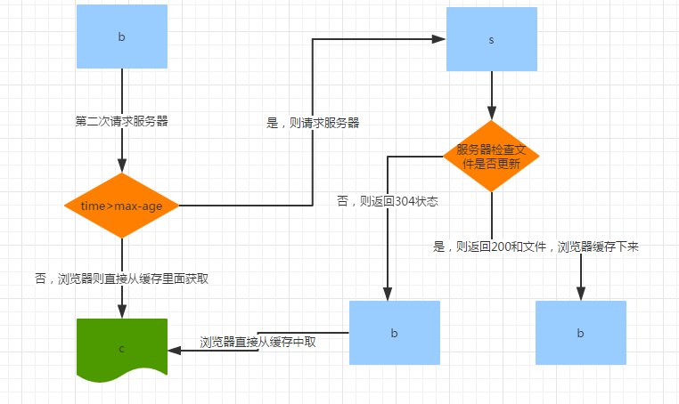
    

### HTTP响应码

[HTTP常用状态码](https://www.cnblogs.com/feng9exe/p/8036657.html)

| 状态码 | 描述                                                         |
| ------ | ------------------------------------------------------------ |
| 100    | 服务器返回此代码标识已收到请求的第一部分，正在等待其余部分   |
| 200    | 服务器成功返回网页                                           |
| 300    | 针对请求，服务器可执行多种操作。服务器可根据请求者选择一项操作，或提供操作列表供请求者选择。 |
| 301    | 永久重定向，请求的网页已永久移动到新位置。服务器返回此响应时，会自动将请求者转到新位置。 |
| 302    | 临时重定向。                                                 |
| 403    | 服务器拒绝请求                                               |
| 404    | 客户端请求的网页不存在                                       |
| 500    | 服务器内部错误，无法完成请求                                 |
| 502    | 服务器目前因为超载或者停机维护而不可用                       |


### TCP的keep alive和HTTP的Keep-alive

TCP的keep alive是检查当前TCP连接是否活着；HTTP的Keep-alive是要让一个TCP连接活久点

## 什么是无状态协议？怎么解决HTTP的无状态协议
无状态对于事物处理没有记忆能力。也就是说当客户端一次HTTP请求完成以后，客户端再发送一次http请求，HTTP并不知道当前客户是一个“老用户”

可以使用Cookie来解决无状态的问题，Cookie就相当于一个通行证，第一次访问的时候给客户端发送一个Cookie，当客户端再次来的时候，拿着Cookie(通行证)，那么服务器就知道这个是”老用户“。
## HTTP优化方案
>[HTTP面试题都在这里](https://zhuanlan.zhihu.com/p/33778904)

* TCP复用：TCP连接复用是将多个客户端的HTTP请求复用到一个服务器端TCP连接上，而HTTP复用则是一个客户端的多个HTTP请求通过一个TCP连接进行处理。前者是负载均衡设备的独特功能；而后者是HTTP 1.1协议所支持的新功能，目前被大多数浏览器所支持。
* 内容缓存：将经常用到的内容进行缓存起来，那么客户端就可以直接在内存中获取相应的数据了。
* 压缩：将文本数据进行压缩，减少带宽
* SSL加速（SSL Acceleration）：使用SSL协议对HTTP协议进行加密，在通道内加密并加速
* TCP缓冲：通过采用TCP缓冲技术，可以提高服务器端响应时间和处理效率，减少由于通信链路问题给服务器造成的连接负担。
 ### HTTPS 建立连接的详细过程
 **HTTPS的定义**
 https是http协议的安全版本，http协议的数据传输是明文的，是不安全的，https使用了SSL/TLS协议进行了加密处理。
http 是基于TCP/IP的关于数据如何在万维网中如何通信的协议。


**HTTPS的缺点**
* HTTPS协议多次握手，导致页面的加载时间延长近50%；
* HTTPS连接缓存不如HTTP高效，会增加数据开销和功耗；
* 申请SSL证书需要钱，功能越强大的证书费用越高。
* SSL涉及到的安全算法会消耗 CPU 资源，对服务器资源消耗较大。


> [HTTPS 建立连接的详细过程

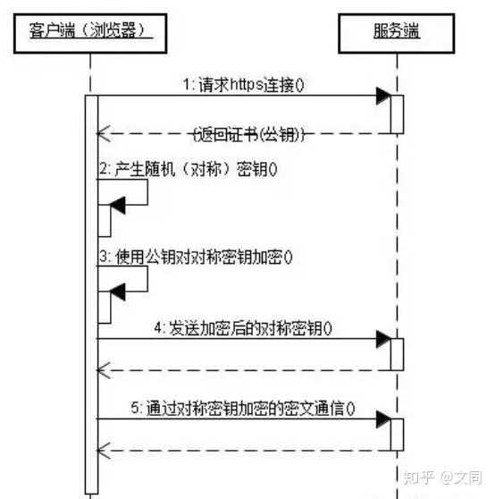


* 首先客户端通过URL访问服务器建立SSL连接。
* 服务端收到客户端请求后，会将网站支持的证书信息（证书中包含公钥）传送一份给客户端。
* 客户端的服务器开始协商SSL连接的安全等级，也就是信息加密的等级。客户端的浏览器根据双方同意的安全等级，建立会话密钥，然后利用网站的公钥将会话密钥加密，并传送给网站。
* 服务器利用自己的私钥解密出会话密钥。
* 服务器利用会话密钥加密与客户端之间的通信。

### 解释ssl协议


### 总结HTTPS和HTTP的区别

- https是http协议的安全版本，http协议的数据传输是明文，是不安全的，https在HTTP的基础上使用了SSL/TLS协议进行了加密处理。

- http和https使用连接方式不同，默认端口也不一样，http是80，https是443。

- https协议需要用到CA申请证书，一般免费证书较少，因而需要一定费用。


### 针对HTTPS的攻击


## GET VS POST


它们是HTTP协议中的两种发送请求的方法。GET和POST本质上就是TCP链接，并无差别。但是由于HTTP的规定和浏览器/服务器的限制，导致他们在应用过程中体现出一些不同。

* GET产生一个TCP数据包；POST产生两个TCP数据包。

## TCP 半连接队列和全连接队列

[TCP半连接队列和全连接队列满了会发生什么？又该如何...](https://www.nowcoder.com/discuss/434093?source_id=profile_create&channel=666)

【太复杂了 看不懂】

在 `TCP` 三次握手的时候，`Linux` 内核会维护两个队列，分别是：

* 半连接队列，也称 `SYN` 队列；
* 全连接队列，也称 `accept` 队列

服务端收到客户端发起的 `SYN` 请求后，内核会把该连接存储到半连接队列，并向客户端响应 `SYN+ACK`，接着客户端会返回 `ACK` ，服务端收到第三次握手的 `ACK` 后，内核会把连接从半连接队列移除，然后创建新的完全的连接，并将其添加到 `accept` 队列，等待进程调用 `accept`函数时把连接取出来。

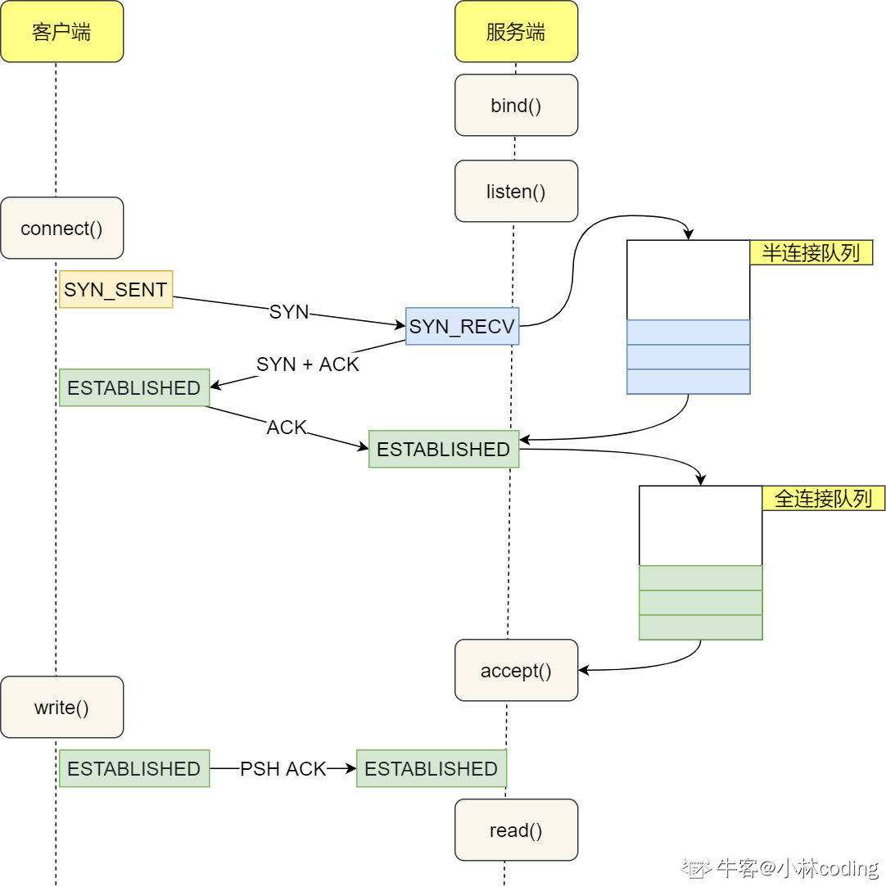

不管是半连接队列还是全连接队列，都有最大长度的限制，超过限制之后，内核会直接丢弃，或返回 `RST` 包。


## MAC地址

## 网络优化方式

 ## URL构成

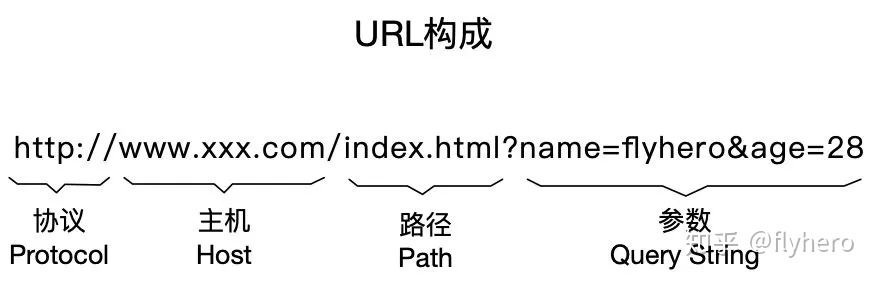

 ## OSI七层协议和TCP/IP四层协议
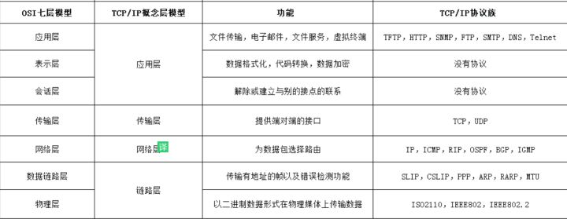

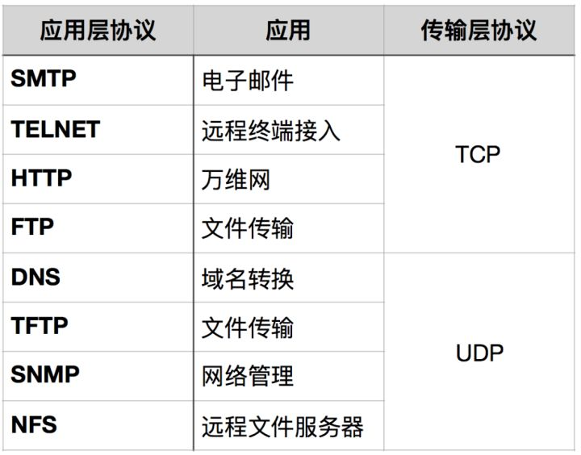


 ## udp怎么实现可靠传输 为什么要这么做?

 ## TCP和UDP的应用场景

TCP 和 UDP 的优缺点无法简单地、绝对地去做比较：
* TCP 用于在传输层有必要实现可靠传输的情况；
* UDP 主要用于那些对高速传输和实时性有较高要求的通信或广播通信。

TCP 和 UDP 应该根据应用的目的按需使用。

### TCP
对准确性要求相对高但对效率要求相对低的场景。
 因为传输中需要对数据确认、重发、排序等操作，相比之下效率没有UDP高。
 举个例子：文件传输（准确度要求高但是速度可以相对慢）、接受邮件、远程登陆

 ### UDP
1.包总量较少的通信（DNS、SNMP等）；
2.视频、音频等多媒体通信（即时通信）；
3.限定于 LAN 等特定网络中的应用通信；
4.广播通信（广播、多播）。


## TCP粘包
>[面试官多次问我TCP粘包，而我为何屡屡受挫？](https://zhuanlan.zhihu.com/p/120752781)


## TCP报文首部详解
>[TCP报文首部详解](https://www.cnblogs.com/tinaluo/p/7751502.html)

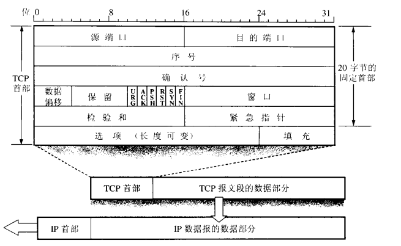


## 一个TCP报文最多传输多少字节(即MSS)
>[一个TCP报文最多传输多少字节(即MSS)](https://www.cnblogs.com/bugutian/p/13025264.html)

1440字节


**补充**
MTU【最大传输单元】的长度：
* 以太网限制长度：1500
* IEEE 802.3要求长度：1492

TCP传输：IP层 20 TCP层 32【MSS为 1492-52=1440】
UDP传输：IP层 20 UDP层 8【MSS为 1492-28=1464】

## HTTP劫持和DNS劫持
>[浅析DNS劫持和HTTP劫持](https://zhuanlan.zhihu.com/p/172374867)
>[【HTTP劫持和DNS劫持】](https://blog.csdn.net/my_bai/article/details/82454662)

###  HTTP劫持
HTTP劫持是指在传输过程中，劫持方伪装成目的服务器抢先给出了响应，使得客户端接受了劫持的响应而抛弃了正确的响应，就是先下手为强，后下手遭殃。甚至有时候劫持方会完全拦截用户的请求，目的服务器没有接受到任何请求。
在运营商的路由器节点上，设置协议检测，一旦发现是HTTP请求，而且是html类型请求，则拦截处理。
劫持后续做法往往分为两种，一种类似DNS劫持返回302让用户浏览器跳转到另外的地址，还有一种是在服务器返回的HTML数据中插入js或dom节点。

**放劫持思路**
1. 采用http协议贾母
2. 隐藏http请求得特征，例如使用堆成贾母算法加密整个url


### DNS劫持


## 滑动窗口 vs 拥塞窗口

### 滑动窗口
TCP通过滑动窗口的概念来进行流量控制，抑制发送端发送数据的速率，以便接收端来得及接受。
**窗口**：对应一段发送者可以发送的字节序列。这个序列是可以改变的。接收端发给发送端自己的接受能力，然后发送端根据已确认接受得序列号和接受能力滑动窗口，一下子全部发送，等待接收端确认。

### 拥塞窗口
拥塞窗口 `cwnd` 是发送方维护的一个状态变量，它会根据网络的拥塞程度动态变化。


## 拥塞控制
>[TCP的拥塞控制（详解）](https://blog.csdn.net/qq_41431406/article/details/97926927)


* 慢开始
* 拥塞避免
* 快重传
* 快恢复

 **快重传**
 让发送方尽快进行重传，而不是等超时重传计时器超时再重传。

发送方发送1号数据报文段，接收方收到1号报文段后给发送方发回对1号报文段的确认，在1号报文段到达发送方之前，发送方还可以将发送窗口内的2号数据报文段发送出去，接收方收到2号报文段后给发送方发回对2号报文段的确认，在2号报文段到达发送方之前，发送方还可以将发送窗口内的3号数据报文段发送出去，假设该报文丢失，接受方便不会发送针对该报文的确认报文给发送方，发送方还可以将发送窗口内的4号数据报文段发送出去，接收方收到后，发现这不是按序到达的报文段，因此给发送方发送针对2号报文段的重复确认，表明我现在希望收到的是3号报文段，但是我没有收到3号报文段，而收到了未按序到达的报文段，发送方还可以将发送窗口中的5号报文段发送出去,接收方收到后，发现这不是按序到达的报文段，因此给发送方发送针对2号报文段的重复确认，表明我现在希望收到的是3号报文段，但是我没有收到3号报文段，而收到了未按序到达的报文段,，发送方还可以将发送窗口内的最后一个数据段即6号数据报文段发送出去，接收方收到后，发现这不是按序到达的报文段，因此给发送方发送针对2号报文段的重复确认，表明我现在希望收到的是3号报文段，但是我没有收到3号报文段，而收到了未按序到达的报文段，发送方收到了累计3个连续的针对2号报文段的重复确认，立即重传3号报文段，接收方收到后，给发送方发回针对6号报文的确认，表明，序号到6为至的报文都收到了，这样就不会造成发送方对3号报文的超时重传，而是提早收到了重传。

**快恢复**
发送方一旦受到3个重复确认，就知道现在只是丢失了个别报文段，于是不启动 **慢开始** 算法，而是执行 **快恢复算法**，即：发送方将慢开始门限 `ssthresh` 以及 `cwnd` 都设为当前窗口的一半，并开始执行拥塞避免算法。


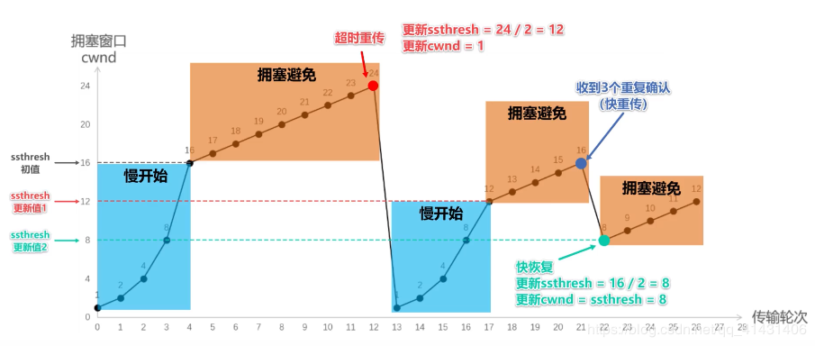


## 流量控制
### 定义以及目的

如果发送者发送数据过快，接收者来不及接收，那么就会有分组丢失。为了避免分组丢失，控制发送者的发送速度，使得接收者来得及接收，这就是流量控制。流量控制根本目的是防止分组丢失，它是构成TCP可靠性的一方面。
### 实现方式

由滑动窗口协议（连续ARQ协议）实现。滑动窗口协议既保证了分组无差错、有序接收，也实现了流量控制。主要的方式就是接收方返回的 ACK 中会包含自己的接收窗口的大小，并且利用大小来控制发送方的数据发送。
### 流量控制引发的死锁？怎么避免死锁的发生？

当发送者收到了一个窗口为0的应答，发送者便停止发送，等待接收者的下一个应答。但是如果窗口不为0的应答在传输过程丢失，发送者一直等待下去，而接收者以为发送者已经收到该应答，等待接收新数据，这样双方就相互等待，从而产生死锁。

为了避免流量控制引发的死锁，TCP使用了持续计时器。每当发送者收到一个零窗口的应答后就启动该计时器。时间一到便主动发送报文询问接收者的窗口大小。若接收者仍然返回零窗口，则重置该计时器继续等待；若窗口不为0，则表示应答报文丢失了，此时重置发送窗口后开始发送，这样就避免了死锁的产生。

### 拥塞控制和流量控制的区别

**拥塞控制**：拥塞控制是作用于网络的，它是防止过多的数据注入到网络中，避免出现网络负载过大的情况；常用的方法就是：（ 1 ）慢开始、拥塞避免（ 2 ）快重传、快恢复。
**流量控制**：流量控制是作用于接收者的，它是控制发送者的发送速度从而使接收者来得及接收，防止分组丢失的。

## 流量控制和拥塞控制的联系
>[30张图解： TCP 重传、滑动窗口、流量控制、拥塞控制发愁](https://zhuanlan.zhihu.com/p/133307545)

**拥塞控制** 避免共享的网络环境出现拥堵。


**流量控制** 避免「发送方」的数据填满「接收方」的缓存，但是并不知道网络的中发生了什么。
## 服务器如果有大量的半连接状态的客户端连接，如何处理

## 问题总结

### http请求的页面和返回的页面不一样，为什么？

### DNS获得 `IP` 地址，黑心运营商返回 错误 `IP` ,这称为 `DNS` 域名污染，请问怎么解决？

# 编译原理
## 程序内存分配


1. **代码段**：存放着程序的机器码和**只读数据**，**可执行指令**就是从这里读取的。多进程中，可共享代码段，但是一般被标记为只读，任何对这个区域的写操作会导致段报错。
2. **数据段**：包括已初始化的数据段(.data)和未初始化的数据段（.bss），前者用来存放保存全局的和静态的已初始化变量，后者用来保存全局的和静态的未初始化变量。数据段在编译时分配。
3. **堆**：程序运行时动态分配的内存段。堆的大小并不固定，可扩张或缩减。其分配由：malloc、new等这类实时分配函数实现。当程序调用malloc()分配内存时，新分配的内存就被动态的添加到堆上（堆扩展）。当利用free()释放内存时，被释放的内存从堆中剔除掉（堆缩减）。堆的释放应该由应用程序控制，通常一个new()就要对应一个delete()，如果程序员没有释放掉，那么在程序结束后操作系统会自动回收。
4. **栈**：用来存储函数调用时的临时信息结构，例如：函数的局部变量、传递的参数、返回值等。
## C++函数调用过程
>[什么是栈帧](https://www.cnblogs.com/lqh969696/p/10955513.html)
>每次函数的调用，都会在调用栈上维护一个独立的栈帧。每个独立的栈帧一般包括：
* 函数的返回地址和参数
* 临时变量：包括函数的非静态局部变量以及编译器自动生成的其他临时变量
* 函数调用的上下文

一个函数的栈帧用ebp和esp这两个寄存器来划定范围，ebp指向当前的栈帧的底部，esp始终指向栈帧的顶部

**函数调用分为以下几步**：
* 参数入栈：将参数按照调用约定（C是从右到左）依次压入系统栈中；
* 返回地址入栈：将当前代码区调用指令的下一条指令地址压入栈中，供函数返回时继续执行；
* 代码跳转：处理器将代码区跳转到被调用函数的入口处；
* 栈帧调整
    - 将调用者的ebp压栈处理，保存指向栈底的ebp的地址（方便函数返回之后的现场恢复），此时esp指向新的栈顶位置； `push ebp`
    - 将当前栈帧切换到新栈帧(将esp值装入ebp，更新栈帧底部), 这时ebp指向栈顶，而此时栈顶就是old ebp `mov ebp, esp`
    - 给新栈帧分配空间 `sub esp, XXX`


**函数返回分为以下几步**：
* 保存被调用函数的返回值到 `eax` 寄存器中 `mov eax, xxx`
* 恢复 `esp` 同时回收局部变量空间 `mov ebp,esp`
* 将上一个栈帧底部位置恢复到 `ebp` `pop ebp`
* 弹出当前栈顶元素，从栈中取到返回地址，并跳转到该位置 `ret`
## 什么是编译型语言和解释型语言
>[什么是编译型语言和解释型语言](https://blog.csdn.net/u012184539/article/details/81348780)


## ELF


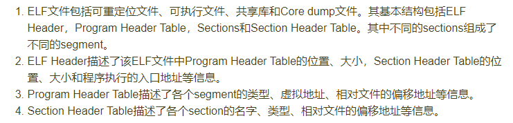

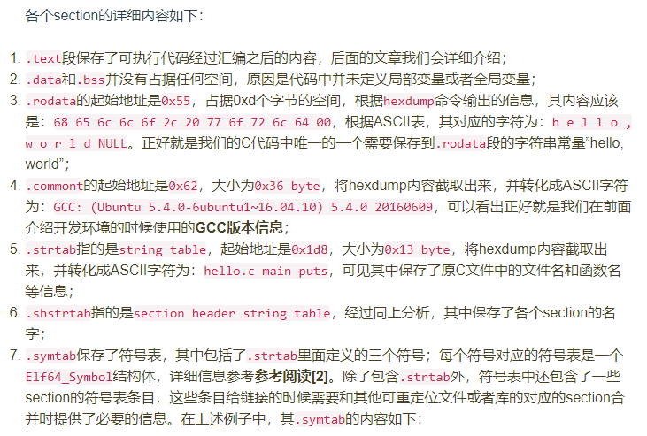

## 内存分区
**外部碎片**：分配单元之间的未被使用的内存；**内部碎片**：分配单元内部的未被使用的内存。
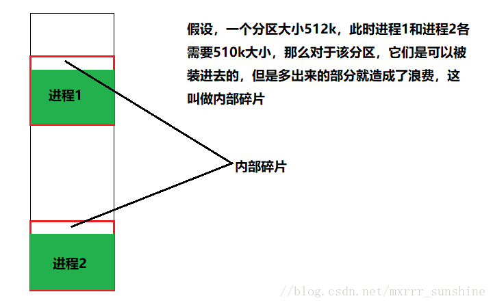


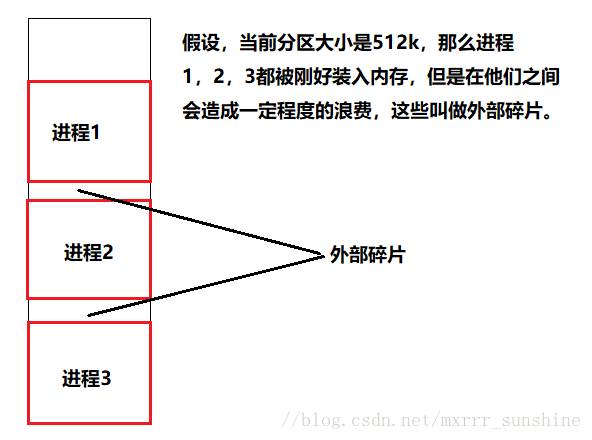

### 固定分区
给进程分配一块小于指定大小的连续的物理内存区域。

1. **固定分区有两种选择**：
* 一种是使用大小相等的分区，此时小于等于分区大小的任何进程都可被装入，若此时所有分区已满，就换出一个进程的所有分区。

* 一种是使用大小不等的分区。将每个进程分配到能够容纳它的最小分区中。


2. **固定分区的缺点**：
* 分区的数量在系统阶段就被定下，限制了系统中活动进程的数量。
* 不能保证所有进程所需大小是能够被预先得知的。除非在这种情况下，固定分区才是有效的。

### 动态分区

## 程序装载
>[重学计算机组成原理（八）-程序的装载](https://zhuanlan.zhihu.com/p/78618545)

在运行可执行文件的时候，通过一个装载器来解析ELF或者PE格式的文件，装载器会把对应的指令和数据加载到内存里面来，让CPU执行。

## 静态链接 and 动态链接

编译链接的过程
1. 对源文件进行预处理，这个过程主要是处理一些#号定义的命令或语句（如宏、#include、预编译指令#ifdef等），生成*.i文件；
2. 然后进行编译，这个过程主要是进行词法分析、语法分析和语义分析等，生成*.s的汇编文件；
3. 最后进行汇编，这个过程比较简单，就是将对应的汇编指令翻译成机器指令，生成可重定位的二进制目标文件。


>[静态链接和动态链接区别](https://www.cnblogs.com/cyyljw/p/10949660.html)

### 静态链接
编译结束后，将产生的目标文件进行链接，直接形成一个可独立执行的程序。

### 动态链接
把程序按照模块拆分成各个相对独立部分，在**程序运行**时才将它们链接成可执行程序。


# 数据库
## 事务的ACID特性
1. **原子性（Atomicity）**
事务是一个不可再拆分的最小单位，要么整个执行，要么整个回滚
2. **一致性（Consistency）**
事务要保证数据库整体数据的完整性和业务数据的一致性，事务成功提交整体数据修改，事务错误则回滚到数据原来的状态。
3. **隔离性（Isolation）**
隔离性是说两个事务的执行都是独立隔离开来的，事务之前不会相互影响，多个事务操作一个对象时会以串行等待的方式保证事务相互之间是隔离的。
4. **持久性（Durability）**
持久性是指一旦事务成功提交后，事务处理过的数据将会保存到数据库，不能再进行回滚;

## 事务并发执行带来的问题
|问题     |定义      |    原因     |
|--------|----------|-------------|
|脏读|事务A可以读到事务B中未提交的数据|修改数据的同时可以读取数据
|不可重复读|事务A先后两次读取同一个数据的结果不一样|读取数据的同时可以进行修改|
|幻读|事务A按照某个条件先后两次查询数据库，两次查询结果的条数不同|读取和修改的时候可以insert数据|


## 事务的四种隔离级别
| 隔离级别     | 定义                                               | 脏读 | 不可重复读 | 幻读 |
| ------------ | -------------------------------------------------- | ---- | ---------- | ---- |
| **读未提交** | 可读取未提交事务的操作数据                         | √    | √          | √    |
| **读提交**   | 一个事务等另一个事务提交之后才可进行读取           | ×    | √          | √    |
| **重复读**   | 读取事务开启的时候不能对数据进行修改               | ×    | ×          | √    |
| **序列化**   | 最高的事务隔离级别，在该级别下，事务串行化顺序执行 | ×    | ×          | ×    |

## 数据库通过什么方式保证了事务的隔离性？
通过加锁来实现事务的隔离性。
>[详解mysql的各种锁（表锁、行锁、共享锁、意向共享锁、记录锁、间隙锁、临键锁）](https://zhuanlan.zhihu.com/p/52312376)

## 算法锁【基于行锁的算法】
### 记录锁（Record Lock）
**定义：** 事务加锁后锁住的只是表的某一条记录。
**记录锁出现条件：** 精准条件命中，并且命中的条件字段是唯一索引；
**记录锁的作用：** 加了记录锁之后可以避免数据在查询的时候被修改的重复读问题，也避免了在修改的事务未提交前被其他事务读取的脏读问题。

### 间隙锁（Gap Lock）
**定义：** 事务加锁后锁住的是表记录的某一个区间，当表的相邻ID之间出现间隙会形成一个区间，遵循 **左开右闭** 原则。


**间隙锁出现的条件：** **范围查询并且查询未命中记录**，查询条件必须命中索引、间隙锁只会出现在REPEATABLE_READ（重复读)的事务级别中。


**间隙锁作用：** 防止幻读问题。保证某个间隙内的数据在锁定情况下不会发生任何变化。

### 临键锁
**定义：** 临键锁是InnoDB的行锁默认算法，它是记录锁和间隙锁的组合，临键锁会把查询出来的记录锁住，同时也会把该范围查询内的所有间隙空间锁住，再之它会把相邻的下一个区间锁住。

**出现条件：** 范围查询并命中，查询命中了索引。

**临键锁的作用：** 结合记录锁和间隙锁的特性，临键锁避免了在范围查询时出现脏读、重复读、幻读问题。加了临键锁之后，在范围区间内数据不允许被修改和插入。

### 悲观锁

[什么是悲观锁](https://www.jianshu.com/p/8a70a4af7eac)

悲观锁采用的是【先获取再访问】的策略来保证数据的安全，但是加锁策略，依赖数据库实现，会增加数据库的负担，且会增加死锁的发生激烈。此外，对于不会发生变化的只读数据，加锁只会增加额外不必要的负担。在实际的实践中，对于并发很高的场景并不会使用悲观锁，因为当一个事务锁住了数据，那么其他事务都会发生阻塞，会导致大量的事务发生积压拖垮整个系统。

当执行 `select ... for update`时，将会把数据锁住，因此，我们需要注意一下锁的级别。**MySQL InnoDB 默认为行级锁**。当查询语句指定了主键时，**MySQL**会执行「行级锁」，否则 **MySQL** 会执行「表锁」。

**常见情况如下：**

- 若明确指明主键，且结果集有数据，行锁；
- 若明确指明主键，结果集无数据，则无锁；
- 若无主键，且非主键字段无索引，则表锁；
- 若使用主键但主键不明确，则使用表锁；

## B树与B+树
> [b+树图文详解](https://blog.csdn.net/qq_26222859/article/details/80631121)

>[通俗易懂 索引、单列索引、复合索引、主键、唯一索引、聚簇索引、非聚簇索引、唯一聚簇索引 的区别与联系](https://zhuanlan.zhihu.com/p/66553466)

## 索引

只包含一个字段的索引叫做单列索引，包含两个或以上字段的索引叫做复合索引（或组合索引）。建立复合索引时，字段的顺序极其重要。


聚簇索引的叶子节点就是数据节点，而非聚簇索引的叶子节点仍然是索引节点，只不过有指向对应数据块的指针。

聚簇索引的顺序就是数据在硬盘上的物理顺序。一般情况下主键就是默认的聚簇索引。**一张表只允许存在一个**聚簇索引。

聚簇索引性能最好，因为一旦具有第一个索引值的记录被找到，具有连续索引值的记录也一定物理地紧跟其后。

聚簇索引默认是主键，如果表中没有定义主键，InnoDB会选择一个唯一的非空索引代替（“唯一的非空索引”是指列不能出现null值得唯一索引，跟主键性质一样）。如果没有这样得索引，InnoDB会 **隐式地** 定义一个主键来作为聚簇索引。

## 并发控制

[事务和并发控制](https://zhuanlan.zhihu.com/p/40811140)

> 事务定义了一个服务器操作序列，由服务器保证这些操作序列在多个客户端并发访问和服务器出现故障情况下的原子性

三种并发控制的方法：

1. 锁

 * 锁的实现

   锁的授予通常有服务器上一个对象实现，我们称该对象为锁管理器（lock manager）。锁管理器把所拥有的锁放在诸如散列表之类的数据结构中。每个锁都是 `Lock` 类的一个实例，并与某个对象相关联。

​		`Lock` 类的每个实例在它的实例变量中维护的信息：1） 被锁住的对象的标识符；2）当前拥有该锁的事务的标识符（共享锁可以有若干拥有者）；3）锁的类型 

> 类Lock的方法都是同步方法，这样试图获得或者释放锁的线程将不会相互干扰。
> 另外，当试图获取正在使用的锁时，线程将调用wait方法等待该锁释放。

	* 可能会存在死锁问题。

2. 时间戳排序

在基于时间戳的并发排序中，事务中的每一个操作在执行之前要先进行验证。如果该操作不能通过验证，那么事务将立即被放弃，然后由客户端重启该事务

每个事务在启动时被赋予了唯一的时间戳，这个时间戳定义了该事务在事务时间序列中的位置，来自不同事务的操作请求可以根据它们的事件进行全排序。

**基本的时间戳排序规则：**

只有在对象最后一次 **读访问** 或者 **写访问** 是由一个较早的事务执行的情况下，事务对该对象的 **写请求** 是有效的。

只有在对象最后一次 **写访问** 是由一个较早的事务执行的情况下，事务对该对象的 **读请求** 是有效的。

3. 乐观并发控制


# C++

## 函数指针和指针函数

> [函数指针和指针函数用法和区别](https://blog.csdn.net/luoyayun361/article/details/80428882)


**指针函数**

简单来说，就是一个返回指针的函数，其本质是一个函数，而该函数的返回值是一个指针。

`int* func(int x, int y);`

**函数指针**

函数指针，其本质是一个指针变量，该指针指向这个函数。总结来说，函数指针就是指向函数的指针。`int (*func)(int x, int y);`

```cpp
#include<bits/stdc++.h>
using namespace std;
int add(int x, int y){
    return x+y;
}
int sub(int x, int y){
    return x-y;
}
int main(){
    //函数指针
    int (*func)(int x, int y);
    func=add;//也可以是fun=&add
    cout<<(*func)(1,2)<<" "; //输出3
    func=&sub;//也可以是fun=&add
    cout<<func(1,2); //输出-1
    return 0;
}
```

## C++类成员函数指针使用介绍

> [C++类成员函数指针使用介绍](https://blog.csdn.net/luoyayun361/article/details/101109522)


### 非静态成员函数

指向类成员函数的指针和普通函数指针的区别在于， **前者需要匹配函数的参数类型和个数以及返回值类型，还要匹配该函数指针所属的类类型**。

**申明**：指向类的成员函数的指针需要在指针前面加上类的类型，格式为：

`typedef 返回值 (类名::*指针类型名)(参数列表);`

**赋值**：需要用类的成员函数地址赋值，格式为：

`指针类型名 指针名=&类名::成员函数名;`

**调用**：针对调用的对象是对象还是指针，分别用 `.*` 和 `->*` 进行调用，格式为：

`(类对象.*指针名)(参数列表);`

`(类指针->*指针名)(参数列表);`

```cpp
class Calculation{
  public:
    int add(int a, int b){
        return a+b;
    }
};

typedef int  (Calculation::*FuncCal)(int, int);

int main(){
    FuncCal funAdd = &Calculation::add;
    Calculation* calPtr=new Calculation;
    cout<<(cal->*funAdd)(1,2);//通过指针调用
    
    Calculation cal;
    cout<<cal.*funAdd(1,2);//通过对象调用
    
    return 0;
}
```

### 静态成员函数

类的静态成员函数和普通函数的函数指针的区别在于，他们是不依赖于具体对象的，所有实例化的对象都共享一个静态成员变量 or 函数，所有静态成员也没有 `this` 指针的概念。

```cpp
class Calculation
{
public:
    static int add(int a,int b){ //非静态函数
        return  a + b;
    }
};

typedef int (*FuncCal)(int,int);

int main()
{
    FuncCal funAdd = &Calculation::add;
    int ret = (*funAdd)(1,2);  //直接引用
    int ret2 = funAdd(3,4);  //直接引用

    cout << "ret = " << ret << endl;
    cout << "ret2 = " << ret2 << endl;
    return 0;
}
```


### 总结

- 如果是类的静态成员函数，那么使用函数指针和普通函数指针没区别
- 如果是类的非静态成员函数，那么使用函数指针 **需要加一个类限制一下**。

## 智能指针

智能指针把普通的指针封装成类，当超出类的作用域时，类会自动调用析构函数释放资源。目的就是为了更安全地使用动态内存。

1. `unique_ptr` 

定义在 <memory> 中的智能指针 (smart pointer)。它持有对对象的独有权，即两个 `unique_ptr` 不能指向一个对象，不能进行复制操作只能进行移动操作。

**如何实现独占呢？**【简单来说，就是该智能指针不支持拷贝和赋值】

[unique_ptr的实现原理](https://www.cnblogs.com/wuyepeng/p/10057830.html)

我们可以在类中把 **拷贝构造函数** 和 **拷贝赋值** 声明为 `private`,  这样就 **不可以** 对指针指向进行拷贝了，也就不能产生指向同一个对象的指针。

因为拷贝构造函数和赋值操作都声明为 `private`，这样每一个智能指针要指向一个对象时只能是指向一个新实例化的对象。

```cpp
class Empty{
    public:
    	Empty(){}//默认构造函数
    	~Empty(){};// 析构函数
    private:
    	Empty(const Empty& rhs){}// 拷贝构造函数
    	Empty& operator=(const Empty& rhs){}//拷贝赋值运算符 e2=e1
}
```


## C++拷贝构造函数

当以拷贝的方式初始化一个对象时，会调用拷贝构造函数；当给一个对象赋值时，会调用重载过的赋值运算符，即使没有显式的重载赋值运算符，编译器也会以默认的方式重载它。默认重载的赋值运算符功能很简单，就是将原有对象的所有成员变量意义赋值给新对象。

## C++重载赋值运算符

[C++重载赋值运算符](https://www.cnblogs.com/ay-a/p/10434676.html)

[C/C++ 引用作为函数的返回值](https://blog.csdn.net/weixin_40539125/article/details/81410008)

对于简单的类，默认的赋值运算符一般就够用了，我们也没有必要再显式地重载它。但是当类持有其他资源时，例如动态分配的内存、打开的文件【？】指向其他数据的指针、网络连接等，默认的赋值运算符就不能处理了，我们必须显式地重载它，这样才能**将原有对象的所有数据都复制给新对象**。

```cpp
#include <iostream>
#include<string>
using namespace std;

class People
{
public:
	People(string name = "", int* ptr =NULL);  // 普通构造函数，
	People(const People &peo);   //显示声明拷贝构造函数
	~People();
	People& operator=(const People &peo);  // 重装赋值运算符
	void Display();
	void SetAge(int age);
private:
	string m_name;
	int* mp_age;

};

People::People(string name, int* ptr)
{
	m_name = name;
	mp_age = ptr;
}

People::People(const People &peo)
{
	this->m_name = peo.m_name;
	this->mp_age = new int(*peo.mp_age);  //重新申请一块内存来存放 age,避免两个对象使用同一块内存
}

People::~People()
{
	//释放内存，防止内存泄漏
	delete mp_age;  
	mp_age = NULL;
}

// 重装赋值运算符
People& People::operator=(const People &peo)
{
	if (this != &peo) 
	{
		this->m_name = peo.m_name;
		if (NULL != this->mp_age)
		{
			*this->mp_age = *peo.mp_age;
		}
		else
		{
			this->mp_age = new int(*peo.mp_age);
		}
	}
	return *this;
}

void People::Display()
{
	cout << m_name <<" is age "<< *mp_age << endl;
}

void People::SetAge(int age)
{
	*mp_age = age;
}

int main()
{
	int* ptr = new int(10);
	string name = "Xiao Ming";
	People people1 = People(name, ptr);
	People people2; 
	people2 = people1;

	people1.Display();
	people2.Display();

	people1.SetAge(15);  // 修改 people1 age
	
	people1.Display();
	people2.Display();

	return 0;
}
/*
输出：
Xiao Ming is age 10
Xiao Ming is age 10
Xiao Ming is age 15
Xiao Ming is age 10  //修改 people1 age 之后 people2 age 没有被修改，

 */

```

**注意要点**：

1. `operator=()` 的返回值类型为 `People &`，这样不但能够避免在返回数据时调用拷贝构造函数【如果不加上&，则函数返回时，先将返回值保存起来，然后返回给接收者，使用引用作为函数的返回值的最大好处是在内存中不产生返回值的副本】，还能够达到连续赋值的目的。`People1=People2=People3`。
2. `this != &peo` 语句的作用是 **判断是否给同一对象赋值**。
3. 赋值运算符除了能有对象应用这样的参数之外，也能拥有其他参数，但是 **其他参数必须给出默认值**，例如 `People& operator=(const People &peo, int a = 100);`
4. `operator=()` 的形参类型为 `const People &`，这样不但能够避免在传参时调用拷贝构造函数，还能够同时接收 `const` 类型和非 `const` 类型的实参.

因为函数参数为引用形参【指针形参同理】，函数是对实参直接操纵，没有 `const` 修饰的 **引用形参** 是不能接受 `const` 类型的变量的，因为函数可能会直接修改实参。换句话说，如果实参不是 `const` 类型的，可以被修改，那么在引用形参或者指针形参时，加不加 `const` 没有影响。

## 显示类型转换

1. `static_cast` 

   转换格式：`static_cast<type_id>(expression)`

   将 `expression` 转换为 `type_id` 类型，主要用于非多态类型之间的转换，不提供运行时的检查来确保转换的安全性。

2. `dynamic_cast`

   转换格式：`dynamic_cast<type_id>(expression)`

   将 `expression` 转换为 `type_id` 类型，`type_id` 必须是类的指针、类的引用或者 `void*`;

   如果 `type_id` 是指针类型，那么 `expression` 也必须是一个指针；

   如果 `type_id` 是引用类型，那么 `expression` 也必须是一个引用。

## 什么是栈帧

>[什么是栈帧](https://www.cnblogs.com/lqh969696/p/10955513.html)
>[从内存角度看C函数的调用过程](https://blog.csdn.net/qq_33724710/article/details/51112548)

每一次函数的调用,都会在调用栈(call stack)上维护一个独立的栈帧(stack frame).每个独立的栈帧一般包括:
* 函数的返回地址和参数
* 临时变量: 包括函数的非静态局部变量以及编译器自动生成的其他临时变量
* 函数调用的上下文

栈是从高地址向低地址延伸,一个函数的栈帧用ebp 和 esp 这两个寄存器来划定范围.
ebp 指向当前的栈帧的底部, esp 始终指向栈帧的顶部;
ebp 寄存器又被称为帧指针(Frame Pointer);
esp 寄存器又被称为栈指针(Stack Pointer);


**函数调用函数调用分为以下几步:**

* 参数入栈: 将参数按照调用约定(C 是从右向左)依次压入系统栈中;
* 返回地址入栈: 将当前代码区调用指令的下一条指令地址压入栈中，供函数返回时继续执行;
* 代码跳转: 处理器将代码区跳转到被调用函数的入口处;
* 栈帧调整: 
    1. 将调用者的ebp压栈处理，保存指向栈底的ebp的地址（方便函数返回之后的现场恢复），此时esp指向新的栈顶位置； `push ebp`
    2. 将当前栈帧切换到新栈帧(将eps值装入ebp，更新栈帧底部), 这时ebp指向栈顶，而此时栈顶就是old ebp  `mov ebp, esp `
    3. 给新栈帧分配空间 ` sub esp, XXX`
    

**函数返回分为以下几步:**
* 保存被调用函数的返回值到 eax 寄存器中 `mov eax, xxx`
* 恢复 esp 同时回收局部变量空间 `mov ebp, esp`
* 将上一个栈帧底部位置恢复到 ebp `pop ebp`
* 弹出当前栈顶元素,从栈中取到返回地址,并跳转到该位置 ret


## C++中的锁
### 互斥锁
可以避免多个线程在某一时刻同时操作一个共享资源，标准库提供了 `std::unique_lock` 类模板，实现了互斥锁的RALL管用语法

## RAII机制
管理资源、避免资源泄漏的方法


## c++类的内存分配

* C++编译系统中，数据和函数是分开存放的(函数放在代码区；数据主要放在栈区和堆区，静态/全局区以及文字常量区也有)，实例化不同对象时，只给数据分配空间，各个对象调用函数时都都跳转到(内联函数例外)找到函数在代码区的入口执行，可以节省拷贝多份代码的空间。
* 类的静态成员变量编译时被分配到静态/全局区，因此静态成员变量是属于类的，所有对象共用一份，不计入类的内存空间。
* 静态成员函数和非静态成员函数都是存放在代码区的，是属于类的，类可以直接调用静态成员函数，不可以直接调用非静态成员函数，**两者主要的区别是有无this指针**。
* 内联函数(声明和定义都要加inline)也是存放在代码区，内联函数在被调用时，编译器会用内联函数的代码替换掉函数，避免了函数跳转和保护现场的开销(实际上到底替不替换还要由编译器决定，即使声明为内联函数也有可能不替换，未声明成内联函数也有可能被编译器替换到调用位置，主要由编译器决定)。
* 如果是带有虚函数的派生类的话？？？多一个虚函数指针表？？？

## 如何限制对象只能建立在堆上或者栈上▲

在C++中，类的对象建立分为两种，一种是静态建立，如A a；另一种是动态建立，如A* ptr=new A；这两种方式是有区别的。


* 静态建立一个类对象，是由编译器为对象在栈空间中分配内存，是通过直接移动栈顶指针，挪出适当的空间，然后在这片内存空间上调用构造函数形成一个栈对象。使用这种方法，直接调用类的构造函数。       
* 动态建立类对象，是使用new运算符将对象建立在堆空间中。这个过程分为两步，第一步是执行operator new()函数，在堆空间中搜索合适的内存并进行分配；第二步是调用构造函数构造对象，初始化这片内存空间。这种方法，间接调用类的构造函数。

### 只能创建在堆上

类对象只能建立在堆上，就是不能静态建立类对象，即不能直接调用类的构造函数。        
容易想到将构造函数设为私有。在构造函数私有之后，无法在类外部调用构造函数来构造类对象，只能使用new运算符来建立对象。然而，前面已经说过，new运算符的执行过程分为两步，C++提供new运算符的重载，其实是只允许重载operator new()函数，而operator()函数用于分配内存，无法提供构造功能。因此，这种方法不可以。        
当对象建立在栈上面时，是由编译器分配内存空间的，调用构造函数来构造栈对象。当对象使用完后，编译器会调用析构函数来释放栈对象所占的空间。编译器管理了对象的整个生命周期。如果编译器无法调用类的析构函数，情况会是怎样的呢？比如，类的析构函数是私有的，编译器无法调用析构函数来释放内存。所以，编译器在为类对象分配栈空间时，会先检查类的析构函数的访问性，其实不光是析构函数，只要是非静态的函数，编译器都会进行检查。如果类的析构函数是私有的，则编译器不会在栈空间上为类对象分配内存。  
因此，将析构函数设为私有，类对象就无法建立在栈上了。代码如下：

```cpp
class A
{
protected:
    A(){}
    ~A(){}
public:
    static A* create()
    {
        return new A();
    }
    void destory()
    {
        delete this;
    }
};
```

试着使用A a;来建立对象，编译报错，提示析构函数无法访问。这样就只能使用new操作符来建立对象，构造函数是公有的，可以直接调用。类中必须提供一个destory函数，来进行内存空间的释放。类对象使用完成后，必须调用destory函数。        
上述方法的一个缺点就是，无法解决继承问题。如果A作为其它类的基类，则析构函数通常要设为virtual，然后在子类重写，以实现多态。因此析构函数不能设为private。还好C++提供了第三种访问控制，protected。将析构函数设为protected可以有效解决这个问题，类外无法访问protected成员，子类则可以访问。        
另一个问题是，类的使用很不方便，使用new建立对象，却使用destory函数释放对象，而不是使用delete。（使用delete会报错，因为delete对象的指针，会调用对象的析构函数，而析构函数类外不可访问）这种使用方式比较怪异。为了统一，可以将构造函数设为protected，然后提供一个public的static函数来完成构造，这样不使用new，而是使用一个函数来构造，使用一个函数来析构。代码如下，类似于单例模式：
```cpp
class A
{
private:
    void* operator new(size_t t){}     // 注意函数的第一个参数和返回值都是固定的
    void operator delete(void* ptr){} // 重载了new就需要重载delete
public:
    A(){}
    ~A(){}
};
```

这样，调用create()函数在堆上创建类A对象，调用destory()函数释放内存。
### 只能创建在栈上

 只有使用new运算符，对象才会建立在堆上，因此，只要禁用new运算符就可以实现类对象只能建立在栈上。将operator new()设为私有即可。代码如下：

```cpp
class A
{
private:
    void* operator new(size_t t){}     // 注意函数的第一个参数和返回值都是固定的
    void operator delete(void* ptr){} // 重载了new就需要重载delete
public:
    A(){}
    ~A(){}
};
```

## C++代码如何调用C编写的代码
>[C++中如何调用C语言的代码实现](https://www.jb51.net/article/182294.htm)

* 每次在使用C语言的API都用 `extern "C"` 来修饰；
* 在自定义C语言库函数的时候，如果该库以后被C++调用，则用 `extern "C"`  修饰，否则不用。
**自定义C语言函数库**
```cpp
//sum.h文件声明
#ifndef __SUM_H
#define __SUM_H

#ifdef __cplusplus
extern "C" {
#endif
 int sum(int a, int b);
#ifdef __cplusplus
}
#endif
#endif

//sum.c文件实现
#include "sum.h"
int sum(int a, int b) {
	return a + b;
}

//main.cpp
#include <math.h>
#include<bits/stdc++.h>
using namespace std;
int main(){
    int a=2,b=3;
    int c=func(a,b);
    cout<<c<<endl;
    return 0;
}
```

`__cplusplus`  这个宏是C++中 **特有的** 。它在加载C++文件的时候 **会提前定义这个宏** ，所以我们只要 **判断文件中是否有这个宏** ，有的话就是C++在调用，没有的话就是C语言。

## C/C++编译后的结果有什么不同？？？

## 子类析构时要调用父类的析构函数吗？

析构函数调用的次序是先派生类的析构后基类的析构，也就是说在基类的的析构调用的时候,派生类的信息已经全部销毁了。

定义一个对象时先调用基类的构造函数、然后调用派生类的构造函数；析构的时候恰好相反：先调用派生类的析构函数、然后调用基类的析构函数。


```cpp
#include<bits/stdc++.h>
using namespace std;

class base{
public:

    base(){
        cout<<"Base constructed"<<endl;
    }
    ~ base(){
        cout<<"Base destroyed"<<endl;
    }
};

class derived:public base{
public:

    derived(){
        cout<<"derived constructed"<<endl;
    }
    ~ derived(){
        cout<<"derived destroyed"<<endl;
    }
};
int main(){
    derived d;

    return 0;
}

```


## 友元


## protected


## 封装 继承 多态
### 封装
将抽象事务封装成类，将类的实现与接口分离，隐藏了类的实现细节；通过设置访问权限，保护类的成员不被随意访问
### 继承
扩展已存在的类，让子类获得父类的属性【功能复用】
### 多态
#### 什么是多态
对于不同对象接收相同消息时产生不同的动作。

C++的多态性具体体现在运行和编译两个方面：在程序运行时的多态性通过继承和虚函数来体现；在程序编译时多态性体现在函数和运算符的重载上；

**动态多态：** 用父类的指针或者引用统一操作各种子类对象。一个动作在不同的情况下有不同的表现。【向后兼容，可扩展】
#### 如何实现多态
>[C++ 虚函数表剖析](https://zhuanlan.zhihu.com/p/75172640)

虚表【同一个类的所有对象都使用同一个虚表，属于类】
虚表指针【属于类的实例即对象，指向虚表】

## 虚函数 纯虚函数 虚继承
### 虚函数
在基类中冠以关键字 `virtual`  的成员函数。 它提供了一种接口界面。允许在派生类中对基类的虚函数重新定义。


### 纯虚函数
在基类中为其派生类保留一个函数的名字，以便派生类根据需要对它进行定义。作为接口而存在 纯虚函数不具备函数的功能，一般不能直接被调用。从基类继承来的纯虚函数，在派生类中仍是虚函数。如果一个类中至少有一个纯虚函数，那么这个类被称为抽象类（abstract class）。抽象类中不仅包括纯虚函数，也可包括虚函数。**抽象类必须用作派生其他类的基类，而不能用于直接创建对象实例。但仍可使用指向抽象类的指针支持运行时多态性。**
纯虚函数的区别
#### 定义

纯虚函数是在基类中声明的虚函数，它在基类中没有定义，但要求任何派生类都要定义自己的实现方法。在基类中实现纯虚函数的方法是在函数原型后加“=0”`virtual void funtion1()=0`

#### 引入原因

1. 为了方便使用多态特性，我们常常需要在基类中定义虚函数。　　
2. 在很多情况下，基类本身生成对象是不合情理的。


###  虚继承
>[为什么要有虚继承？是为了解决什么问题？](https://www.jianshu.com/p/ab96f88e5285)、

从不同途径继承来的同一基类会在子类中存在多份拷贝。这就带来了两个问题：
1. 浪费空间
2. 存在二义性

针对这个问题，C++提供了虚基类的方法，使得在继承间接共同基类时只保留一份成员。


> 虚基类并不是在声明基类时声明的，而是在声明派生类时，指定继承方式时声明的。因为一个基类可以在生成一个派生类时作为虚基类，而在生成另一个派生类时不作为虚基类。

```cpp

class A    // 声明基类A
{
    // 代码
};
class B: virtual public A    // 声明类 B 是类 A 的公有派生类，A 是 B 的虚基类
{
    // 代码
 };
class C: virtual public A    // 声明类 C 是类 A 的公有派生类，A 是 C 的虚基类
{
    // 代码
};
class D: public B, public C    // 类 D 中只有一份 A 的数据
{
    // 代码
};
```
#### 如何对虚基类进行初始化
在最后的派生类中不仅要负责对其直接基类进行初始化，还要负责对虚基类初始化

#### 最后的派生类初始化时，虚基类构造函数调用次数
**1次**

C++ 编译系统只执行最后的派生类对虚基类的构造函数的调用，而忽略虚基类的其他派生类（如类 B 和类 C）对虚基类的构造函数的调用，这就保证了虚基类的数据成员不会被多次初始化。

#### 虚基类表和虚函数表的对比

每个虚继承的子类都有一个**虚基类表指针**（占用一个指针的存储空间，4字节）和**虚基类表**（不占用类对象的存储空间）。虚基类表指针（virtual base table pointer）指向虚基类表（virtual table），**虚表中记录了虚基类与本类的偏移地址**，通过偏移地址，就找到了虚基类成员。

在这里我们可以对比虚函数的实现原理：
* **它们有相似之处**，都利用了虚指针（均占用类的存储空间）和虚表（均不占用类的存储空间）。
* 虚基类依旧存在继承类中，占用存储空间；虚函数不占用存储空间。
* 虚基类表存储的是虚基类相对直接继承类的偏移；而虚函数表存储的是虚函数地址。


#### 占内存大小
```cpp****

class A    // 大小为 4 
{  
public:  
    int a;  
};  
class B :virtual public A    // 大小为 12，变量 a, b 共 8  字节，虚基类表指针 4 
{  
public:  
    int b;  
};  
class C :virtual public A   // 与 B 一样 12  
{  
public:  
    int c;  
};  
class D :public B, public C    // 24, 变量 a, b, c, d 共 16，B 的虚基类指针 4，C 的虚基类指针 4 注意这里不是虚继承
{  
public:  
    int d;  
};  
```

## 不能声明为虚函数的函数
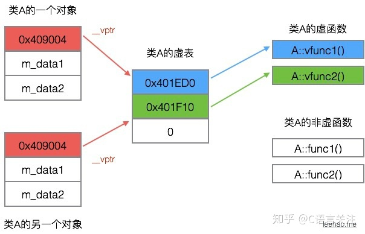

* 构造函数
>[为什么构造函数不能为虚函数](https://blog.csdn.net/jiadebin890724/article/details/7951520)
>虚函数的调用是通过对象【类的实例】的虚表指针 `vptr` 来实现。
>如果构造函数声明为虚函数，当需要调用构造函数生成对象时，对象还未生成，没有虚表指针，无法调用虚表中的构造函数。
* 友元函数【友元函数不属于类的成员函数，不能被继承】
* 内联函数
* 静态成员函数 其属于类，不属于某个对象
* 普通函数

## 指向派生类的基类指针和指向派生类的派生类指针区别
指向派生类的基类指针能访问
* 基类的公有接口
* 如果基类中的成员函数被定义为虚函数，并且在派生类中也实现了该函数，则该基类指针访问该函数时，执行的是派生类的功能

指向派生类的派生类指针能访问：
* 派生类的所有公有接口
* 基类中的公有接口

>派生类指针指向基类对象时会产生编译错误。
## union
* union不支持继承，不能定义虚函数
* union和struct一样，没有制定访问权限时默认为public
* union内的变量 **共享内存**，其大小是按照union里面的成员内存的最大值而分配的，函数不占内存，但是如果没有成员或者成员都是函数时，内存分配为1，占位，表明存在。不能用作静态、引用类型


## 内存对齐
### 什么叫内存对齐

对齐规则是按照成员的声明顺序，依次安排内存，其偏移量为成员大小的整数倍，最后结构体的大小为最大成员的整数倍。
### 为什么需要内存对齐
1. 性能原因
因为处理器读写数据，并不是以字节为单位，而是以块（2，4，8，16字节）为单位。如果不进行对齐，那么本来只需要一次进行的访问，可能需要好几次才能完成，并且还要进行额外的merger或者数据分离，导致效率低下。
2. 平台原因
不是所有的硬件平台都能访问任意地址上的任意数据的

### c++ 类在内存中的大小（含虚函数，虚基类）
>[c++ 类在内存中的大小（含虚函数，虚基类）](https://blog.csdn.net/wuxuzhao/article/details/7435162)


## 关键字
### this关键字
### constexpr
### static
> [static作用（修饰函数、局部变量、全局变量）](https://www.cnblogs.com/stoneJin/archive/2011/09/21/2183313.html)

#### 作用
1. **隐藏**：当我们同时编译多个文件时，所有未加static前缀的全局变量和函数都具有全局可见性。

2. **保持变量内容的持久**：存储在静态数据区的变量会在程序在运行前就完成初始化，也是唯一的一次初始化。

```cpp
#include <stdio.h>

int fun(void){
    static int count = 10;    // 事实上此赋值语句从来没有执行过,
    return count--;
}

int count = 1;

int main(void)
{
    printf("global\t\tlocal static\n");
    for(; count <= 10; ++count)
        printf("%d\t\t%d\n", count, fun());

    return 0;
}
```

结果

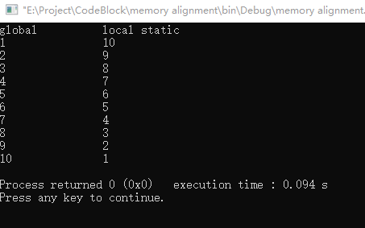

如果将 `static int count = 10; `改成 `int count = 10; `，则结果为：

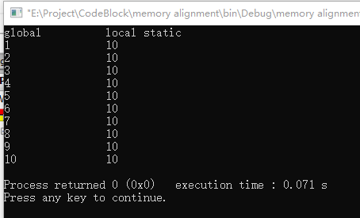

**默认初始化为0**。

#### 比较

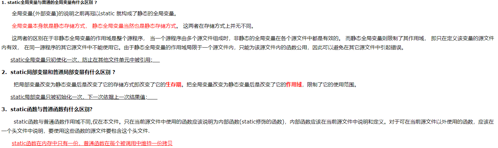

####  static在C++类的使用
* 类的静态成员变量必须先初始化再使用。**必须在类外初始化，不能通过构造函数初始化**，初始化格式为 int 类名::静态变量名=初始值。

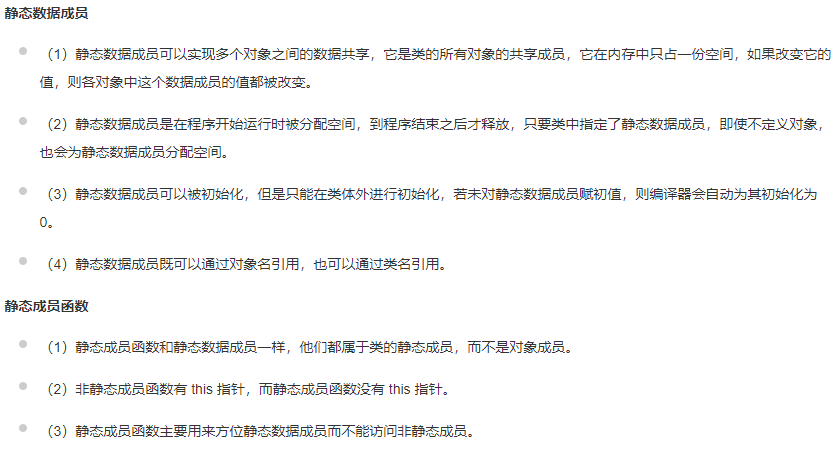


### const
**编译器通常不为普通const常量分配存储空间，而是将它们保存在符号表中，这使得它成为一个编译期间的常量，没有了存储和度内存的操作，使得它的效率很高。**

### final
**禁止继承**：
C++11中允许将类标记为final，方法是直接在类名称后面使用关键字final，如此，意味着继承该类会导致编译错误。

**禁用重写**
这意味着无法再子类中重写该方法。这时final关键字置于方法参数列表后面。
```cpp
class Super
{
  public:
    Super();
    void SomeMethod() final;
};
class test:public Super{
    void SomeMethod(){cout<<"hahah"<<endl;}
};
int main(){
    cout<<sizeof(test)<<endl;
return 0;
}
```
> 编译错误


**final修饰的特点，基本类型和类类型**？？？

static final修饰的一个int 进行修改后是否需要进行重新编译

### volatile

### mutable

[[C++中的mutable关键字]](https://www.cnblogs.com/yongdaimi/p/9565996.html)

`mutable` 是为了突破 `const` 的限制而设置的。被 `mutable` 修饰的变量，将永远处于可变的状态，即使在一个 `const` 函数中。

经典的应用场景：测试一个类中某个函数的调用次数

```cpp
class Person{
    public:
    	Person(){
            m_nums=0;
        }
    	~Person(){}
    	int getAge()const{
            m_nums++;
            return age;
        };
    	int getCallingTimes()const{
            return m_nums;
        }
    private:
    	int age;
    	char* name;
    	float score;
    	mutable int m_nums;//将调用次数 `m_nums` 定义为 `mutable` 类型的，这样就可以在 const修饰的函数中对其进行修改
}
```

### lock_guard

自动加锁、释放锁

**原理**：声明一个局部的 `lock_guard` 对象，在其构造函数中进行加锁，在其析构函数进行解锁。

最终的结果就是：在定义该局部对象的时候加锁（调用构造函数），出了该对象作用域的时候解锁（调用析构函数）

下面是一个使用 `lock_guard` 的例子，`1+2+...+100` 的多线程实现，每个 `num` 只能由一个线程处理。

```cpp
#include <thread>
#include <mutex>
#include <vector>
#include <iostream>
#include <algorithm>

std::mutex my_lock;

void add(int &num, int &sum){
    while(true){
        std::lock_guard<std::mutex> lock(my_lock);  
        if (num < 100){ //运行条件
            num += 1;
            sum += num;
        }   
        else {  //退出条件
            break;
        }   
    }   
}

int main(){
    int sum = 0;
    int num = 0;
    std::vector<std::thread> ver;   //保存线程的vector
    for(int i = 0; i < 20; ++i){
        std::thread t = std::thread(add, std::ref(num), std::ref(sum));
        ver.emplace_back(std::move(t)); //保存线程
    }   

    std::for_each(ver.begin(), ver.end(), std::mem_fn(&std::thread::join)); //join
    std::cout << sum << std::endl;
}
```


## 什么是“引用”？申明和使用“引用”要注意哪些问题？
引用就是某个目标变量的“别名（alias）”，对引用的操作与对变量直接操作效果完全相同。

* 申明一个引用的时候，切记要对其进行初始化。
* 引用不能重新定义。


### 常引用
既要利用引用提高程序的效率，又要保护传递给函数的数据不再函数中改变，就应使用常引用。
`const 类型标识符 &引用名=目标变量名`

### 将“引用”作为函数参数有哪些特点？
1. 传递引用给函数与传递指针的效果是一样的。这时，被调函数的形参就成为原来主调函数中的实参变量或对象的一个别名来使用，所以在被调函数中对形参变量的操作就是对其相应的目标对象（在主调函数中）的操作。
2. 使用引用传递函数的参数，在内存中并没有产生实参的副本，它是直接对实参操作；而使用一般变量传递函数的参数，当发生函数调用时，需要给形参分配存储单元，形参变量是实参变量的副本；如果传递的是对象，还将调用拷贝构造函数。因此，当参数传递的数据较大时，用引用比用一般变量传递参数的效率和所占空间都好。
3. 使用指针作为函数的参数虽然也能达到与使用引用的效果，但是，在被调函数中同样要给形参分配存储单元，且需要重复使用"*指针变量名" 的形式进行运算，这很容易产生错误且程序的阅读性较差；另一方面，在主调函数的调用点处，必须用变量的地址作为实参。而引用更容易使用，更清晰。


## vector扩容
>[C++ STL 中 vector 内存用尽后, 为什么每次是 2 倍的增长, 而不是 3 倍或其他值?](https://www.zhihu.com/question/36538542/answer/67929747)

Vector通过一个连续的数组存放元素，如果集合已满，在新增数据的时候，就要分配一块更大的内存【一般是以成倍的方式扩容】，将原来的数据复制过来，释放之前的内存，在插入新增的元素；
## 数组和链表的区别
### 数组

* 在内存中，数组是一块连续的区域。
* 数组需要预留空间，在使用前要先申请占内存的大小，可能会浪费内存空间。
* 随机读取效率很高
* 不利于扩展
### 链表
* 在内存中可以存在任何地方，不要求连续。
* 每一个数据都保存了下一个数据的内存地址。
* 查找数据时效率低，因为不具有随机访问性
* 不指定大小，扩展方便。

### 比较

|      | 数组   | 链表   |
| ---- | ------ | ------ |
| 读取 | $O(1)$ | $O(n)$ |
| 插入 | $O(n)$ | $O(1)$ |
| 删除 | $O(n)$ | $O(1)$ |


## vector list set的区别

## C++11里面构造函数有几种

## 父类子类构造、析构顺序

## 抽象类和接口的区别，什么时候用抽象类什么时候用接口


## 手写一个线程安全的单例


~~## 双亲委派模型、为什么要双亲委派、可以破坏吗？~~


## C++ 重载、覆盖【重写】、隐藏、重写
> [C++ 成员函数的重载，继承，覆盖和隐藏](https://zhuanlan.zhihu.com/p/78125970)


### 重载
重载允许存在多个同名函数，而这些函数的参数列表不同（参数类型、参数数量、或两者）

重载有这么几个特点：
* 具有相同的作用域；
* 函数名相同；
* 参数类型、顺序或者数目不同。
* virtual 关键字可有可无
```cpp
1. void func(int a) ====> void func(Base * this, int a)

2. virtual func(int a) ====> virtual func(Base *this, int a)

3. void func(int a)const ===> void func(const Base *this, int a) const
```

所以1和2是重复定义，3是重载

 ### 覆盖【重写】
子类重新定义**父类虚函数**【必须是虚函数】的方法。当子类重新定义了父类的虚函数后，父类指针根据赋给它的不同的子类指针，动态调用属于子类的该函数，这样的函数调用在编译期间是无法确定的。**如果一个方法不能被继承，则不能重写它，如private方法**

覆盖有这么几个特点：
* 在不同的类中；
* 函数名相同；
* 参数列表完全相同；
* **基类该函数有virtual关键字。**
* 将派生类的对象赋给基类指针或者引用，实现多态。

* 重写方法不能比被重写方法限制有更严格的访问级别。
* 子类不能用静态方法重写父类的非静态方法
* 子类不能用非静态方法重写父类的静态方法


### 隐藏
隐藏是指派生类的成员函数遮蔽了与其同名的基类成员函数。

隐藏是一个比较出错的一个概念，满足下面两种情况才能算是隐藏。

* 基类与派生类的两个函数，函数名相同，返回值相同，参数相同，但是基类函数没有virtual关键字【如果有virtual关键字，则是覆盖】，满足这种情况的是一种隐藏（注意与覆盖区分）；
* 基类与派生类的两个函数，函数名相同，返回值相同，参数不同，这时基类的函数有没有关键字都无所谓，这种情况也是一种隐藏（注意与重载区分）。

```cpp
#include <bits/stdc++.h>

using namespace std;
class Base{
public:
    static int var;
    void func(){
        cout<<"In Base"<<endl;
    }
};
int Base::var=10;

class Derived:public Base{
public:
    void func(int a){
        cout<<"In Derived"<<endl;
    }


};
int main()
{
    Derived d;
///    d.func(); 这种情况会报错，因为派生类已经将父类的func()函数隐藏了。
    d.func(1);
    return 0;
}
```

## C++是不是类型安全的？
不是。两个不同类型的指针之间可以强制转换（用reinterpret cast)。C#是类型安全的。

## main 函数执行以前，还会执行什么代码？

全局对象的构造函数会在main 函数之前执行。

## 智能指针

1. `unique_ptr`

   


## 问题总结

### extern “c"的作用。有一个c++库和一个c库，使用extern “c"和不使用extern “c"编写代码，生成的文件有什么不同

### NULL 和 nullptr

`NULL` 会被模板推断为 `int`，但 `nullptr` 就可以完美转发至T*

```cpp
void foo(int); //（1）
void foo(void *); //（2）

//函数重载时：
foo(NULL) 选择的是 （1）而不是 (2)
```


# 其他
## 面试题

### `GBK` 和 `UTF-8` 文字编码的区别

`GBK` 的文字编码是双字节来表示，即不论中、英文，字符均使用双字节来表示，为了区分中文，将其最高为都定成 `1`

`UTF-8` 编码则是用以解决国际上字符的一种多字节编码，它对英文使用 `8` 位，中文使用 `24` 位（三个字节）来编码。


### 分页大小为什么是 `4096` 


1. 客户端如何能让服务端知道自己还活着？？
客户端每隔一段固定的时间向服务器发送一次“保持连接”【持久连接】的请求，服务器在收到该请求后对客户端进行回复，表明知道客户端“在线”。
2. TCP发送数据时，如何处理数据包
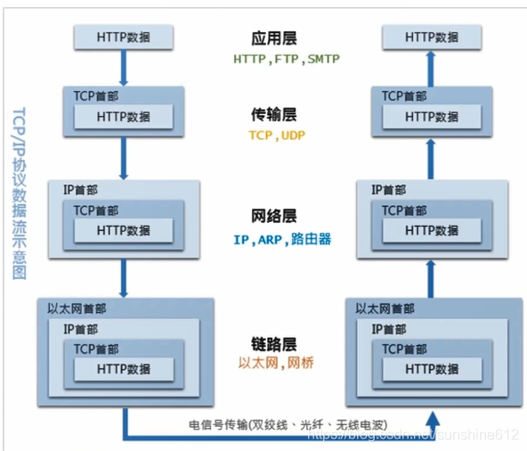
3. TCP把应用层传来的报文看成字节流，将字节流拆成大小不等的数据块，并添加TCP首部
4. 发送数据可以用HTTP来发送吗？？？

## 服务端close-wait或者time-wait状态过多会导致什么样的后果？


## TCP连接 HTTP连接和Socket连接的区别

1. **TCP连接与HTTP连接的区别**
上文提过，HTTP是基于TCP的，客户端往服务端发送一个HTTP请求时第一步就是要建立与服务端的TCP连接，也就是先三次握手，“你好，你好，你好”。从HTTP 1.1开始支持持久连接，也就是一次TCP连接可以发送多次的HTTP请求。小总结：HTTP基于TCP
2. **TCP连接与Socket连接的区别**
socket层只是在TCP/UDP传输层上做的一个抽象接口层，因此一个socket连接可以基于连接，也有可能基于UDP。基于TCP协议的socket连接同样需要通过三次握手建立连接，是可靠的；基于UDP协议的socket连接不需要建立连接的过程，不过对方能不能收到都会发送过去，是不可靠的，大多数的即时通讯IM都是后者。小总结：Socket也基于TCP
3. **HTTP连接与Socket连接的区别**
区分这两个概念是比较有意义的，毕竟TCP看不见摸不着，HTTP与Socket是实实在在能用到的。
* HTTP是短连接，Socket(基于TCP协议的)是长连接。尽管HTTP1.1开始支持持久连接，但仍无法保证始终连接。而Socket连接一旦建立TCP三次握手，除非一方主动断开，否则连接状态一直保持。
* HTTP连接服务端无法主动发消息，Socket连接双方请求的发送先后限制。这点就比较重要了，因为它将决定二者分别适合应用在什么场景下。HTTP采用“请求-响应”机制，在客户端还没发送消息给服务端前，服务端无法推送消息给客户端。必须满足客户端发送消息在前，服务端回复在后。Socket连接双方类似peer2peer的关系，一方随时可以向另一方喊话。
4. **什么时候该用HTTP，什么时候该用socket**
这个问题的提出是很自然而然的。当你接到一个与另一方的网络通讯需求，自然会考虑用HTTP还是用Socket。
* 用HTTP的情况：双方不需要时刻保持连接在线，比如客户端资源的获取、文件上传等。
* 用Socket的情况：大部分即时通讯应用(QQ、微信)、聊天室、苹果APNs等。

## 为什么需要传输层


## 弱/软引用区别
>[C++ - 强引用和弱引用](https://www.cnblogs.com/kuzhon/articles/5648807.html)
1. 强引用
当对象被创建时，计数为1；每创建一个变量引用该对象时，该对象的计数就增加1；当上述变量销毁时，对象的计数减1，当计数为0时，这个对象也就被析构了。

强引用计数在很多种情况下都是可以正常工作的，但是也有不凑效的时候，当出现循环引用时，就会出现严重的问题，以至于出现内存泄露.
>循环引用
```cpp
#include <iostream>
#include <bits/stdc++.h>
using namespace std;

class B;
class A {
public:
    shared_ptr<B> ptrB;
    A(){
        cout<<"A ctor"<<endl;
    }
    ~A(){
        cout<<"A dctor"<<endl;
    }
};

class B {
public:
//    weak_ptr<A> ptrA;
    shared_ptr<A> ptrA;
    B(){
        cout<<"B ctor"<<endl;
    }
    ~B(){
        cout<<"B dctor"<<endl;
    }
};

int main() {
    {
        shared_ptr<A> pA(new A);
        shared_ptr<B> pB(new B);
        cout<<pA.use_count()<<endl;
        cout<<pB.use_count()<<endl;
        pA->ptrB = pB;
        pB->ptrA = pA;
        cout<<pA.use_count()<<endl;
        cout<<pB.use_count()<<endl;
    }
    return 0;
}
```

在多线程程序中，一个对象如果被多个线程访问，一般使用 **shared_ptr**，通过引用计数来保证对象不被错误的释放导致其他线程访问出现问题。但这种引用计数解决不了循环引用的问题
**解决方法**
* 手动打破
在使用的最后对一个对象进行释放，循环就会打破
如 `ptr-> `
* 弱引用

2. 弱引用
弱引用并不参与引用计数的计算。

当最后一个指向某对象的 **shared_ptr** 被销毁，即使仍有 **weak_ptr** 继续指向同一对象，该对象仍旧会被删除，weak_ptr会被自动标示无效。

```cpp
#include <iostream>
#include <bits/stdc++.h>
using namespace std;

class B;
class A {
public:
    shared_ptr<B> ptrB;
    A(){
        cout<<"A ctor"<<endl;
    }
    ~A(){
        cout<<"A dctor"<<endl;
    }
};

class B {
public:
/   weak_ptr<A> ptrA;
    //shared_ptr<A> ptrA;
    B(){
        cout<<"B ctor"<<endl;
    }
    ~B(){
        cout<<"B dctor"<<endl;
    }
};

int main() {
    {
        shared_ptr<A> pA(new A);
        shared_ptr<B> pB(new B);
        cout<<pA.use_count()<<endl;
        cout<<pB.use_count()<<endl;
        pA->ptrB = pB;
        pB->ptrA = pA;
        cout<<pA.use_count()<<endl;
        cout<<pB.use_count()<<endl;
    }
    return 0;
}
```


## 哈希表解决冲突的方法
## 内存泄漏和内存溢出【OOM】的区别，有什么联系
>[面试题：什么是内存泄漏？内存溢出？](https://zhuanlan.zhihu.com/p/69151763)

**内存泄漏**：申请的内存使用完后没有被释放，导致后面的程序无法使用这块内存

**内存溢出**：指程序在申请内存时，没有足够的内存空间供其使用，出现out of memory；比如申请了一个int类型的变量，但是给它存了long才能存下的数，那就是内存溢出。


## 调试程序
## 设计模式：观察者模式、代理模式、单例模式✳
### 单例模式

双锁检测？？？
1. 将构造函数、析构函数私有化，这样保证在类外无法调用类的构造函数创建类的实例，只能通过类内部定义的方法进行创建；
2. 在类内定义静态的，指向该类的指针变量 `ptr`, 负责保存创建的类的实例，并在类外部初始化为 `nullptr`；
3. 在类内部定义静态的实例化对象的方法，以及对对象进行销毁的方法。构造函数中，如果 `ptr` 为 `nullptr`，则在堆空间上进行对象的创建，否则直接返回该指针；对象的销毁方法中，如果指针不为空，则进行析构，回收申请的堆空间。

```cpp
class Singleton {
public:
    static Singleton* getInstance() {
        if(nullptr == ptr) {
         	cout << "getInstance()" << endl;
            ptr = new Singleton(); //调用构造函数对对象进行实例化
		}
        return ptr; //返回指向该对象的指针
    }

    static void destory() {
        if(ptr) {
            delete ptr; // 回收堆空间
            ptr = nullptr;  // 防止野指针
        }
    }
    void print_this(){
        cout<<"Address:"<<this<<endl;
    }

private:
    Singleton() { //构造函数
        cout << "Singleton()" << endl;
    }

    ~Singleton() { //析构函数
        cout << "~Singleton()" << endl;
    }
    static Singleton* ptr;  //指向该对象的指针
};

Singleton* Singleton::ptr = nullptr; //静态对象在类外进行初始化

int main(int argc, char const *argv[])
{
    Singleton* t1 = Singleton::getInstance();
    Singleton* t2 = Singleton::getInstance();
    t1->print_this();
    t2->print_this();
    t1->destory();
    //t2->destory()； 
    return 0;
}
```
单例模式要素：
* 私有构造函数
* 私有静态引用指向自己实例
* 以自己实例为返回值的公有静态方法

### 观察者模式

定义对象之间的一种一对多依赖关系，使得每当一个对象状态发生改变时，其相关以来对象皆得到通知并自动更新。观察者模式是一种对象行为型模式。

观察者模式包含观察目标和观察者两类对象，一个对象可以有任意数目的与之相依赖的观察者，一旦观察目标的状态发生改变，所有的观察者都将得到通知。

### 代理模式

## 断点续传

>[2020-07-05：tcp和udp的区别和应用场景。如何实现断点续传？](https://www.zhihu.com/question/405077002/answer/1365828871)


断点续传的关键在于：让接收端每次都记录下接收多少数据，在连接丢失的情况下，重连发送端并告知接受了多少，让发送端从断开处发送数据。


断点续传功能需要可以基于tcp或者udp实现。

基本原理就是在tcp数据或者udp数据域增加自定义消息。

自定义请求消息包含3类，请求包，数据包，结束包。

自定义响应消息包括，请求应答包，结束应答包。
流程
1. 发送端发送请求包，参数包含文件名，文件大小。
2. 接收端收到请求包后，发送请求应答包。参数包含文件名(id) ，接收端文件大小(分三种情况，1接收端不存在，2接收端存在，其中文件存在又分两种情况，存在且完整(文件大小与发送端文件大小一致) ；存在但与发送端文件大小不一致) 。
3. 发送端收到请求应答包后，判断应答包中的文件大小，若进行续传，则将文件指针偏移，进行续传。

基于udp的还需实现udp的可靠传输。

## Unicode 和 UTF-8 有什么区别？

>[Unicode 和 UTF-8 有什么区别？](https://www.zhihu.com/question/23374078)

## UML图

### 泛化是什么关系，用什么符号表示


## 断点的底层是怎么实现的

## 项目开发常用的测试
### 黑盒测试and白盒测试
### 设计聊天框的测试用例
### 测试流程，测试一般在什么时候介入合适

## 表T，列A，B，C，A为主键，C含有重复值，查找C列重复的记录
select * from T group by C having count(*)>1

select  * from  t where c in (select c from t group by c having count(*)>1)???
## 数字签名
## Linux的常用命令
## 
>[DOS攻击、DDOS攻击不懂？看完让你秒懂！](https://zhuanlan.zhihu.com/p/79201759)


通过公私钥的特性，还可以解决身份认证的事情，比如说有一个股票交易所，收到Tom的一封邮件，要求交易2000股的股票，这个信息本身不是隐私信息，不需要加密，但重要的是股票交易所怎么确认这个请求就是Tom发出的，而不是Jim的恶作剧呢？

Tom可以持有一对公私钥，然后对这封邮件做一个hash（可能包含其他内容，例如时间戳），再用私钥对hash值进行加密，加密内容附在邮件的后面，股票交易所收到邮件后，向Tom请求一个公钥，用公钥对附加的加密内容进行解密，然后对邮件内容也做一个hash，将解密出来的内容和hash值进行比较，如果相同，则说明这封邮件就是Tom发出了的，而且没有经过篡改。通过这种方式，可以确保数据没有被更改过，且能推断出起消息来源，因此叫数据签名。


确认应答
数据校验
数据排序
超时重传
流量控制
拥塞控制


申请的内存空间没有被正确释放，导致后续程序这块内存被永远占用

当子类重新定义了父类的虚函数后，父类指针根据赋给它的不同的子类指针，动态的调用属于子类的该函数，这样的函数调用在编译期间是无法确定的（调用的子类的虚函数地址无法给出）。因此，这样的函数地址是在 **运行期** 绑定的（晚绑定）


智能指针和lambda表达式????

析构函数为虚函数==》如果析构函数不被声明成虚函数，则编译器实施静态绑定，在删除基类时，只会调用基类的析构函数而不调用派生类的析构函数，造成派生类析构不完全。Animal* a=new cat; 这种情况下，如果删除基类a ，则派生类析构不完全？？？


抽象类是特殊的类，不能被实例化（将定义了纯虚函数的类称为抽象类）；除此之外，具有类的其他特性：


HTTP VS https

物理内存：
操作系统为了对进程地址空间进行管理而设计的逻辑意义上的内存空间，让应用程序认为它拥有连续可用的内存，提高物理内存的利用率，

操作系统：虚拟内存，任务调度
计算机网络：tcp，udp，http和https，三次握手，四次挥手
数据库：b树，b+树，红黑树，聚簇/非聚簇索引，索引覆盖


最左前缀匹配原则
主键外键一定要建索引
对where;on;group by; order by中出现的列要建索引
尽量选择区分度高的列作为索引
为较长的字符串使用前缀索引
尽量的扩展索引，不要新建索引
对于like查询，%不要放在前面
条件数据类型不匹配
正则表达式

内存泄漏：申请的内存空间没有释放，导致后续程序无法使用这段内存
- 指针变量超出作用域但其所指的内存没有被释放
指针数组没有使用delete[]释放
- 一个指针所指的对象没有其他指针指向这个对象，但这个指针转而指向其他对象，原对象所在的内存区域没有被释放
- 父类析构函数没有声明成虚函数，而子类中新分配了堆内存。当指向子类对象的父类指针被销毁时
- shared_ptr中的循环使用
- 使用指针时抛出异常而导致跳过delete语句

野指针：指向已经释放或访问受限的内存的指针
- 指针变量没有初始化
- 指针被free或者delete后没有置为nullptr【悬垂指针】
- 指针操作超越了变量的作用范围


虚基类


1. 进程是资源分配的最小单位，线程是cpu调度的最小单位
2. 一个进程包括多个线程
3. 进程共享内存很难，线程共享内存较为容易
    - 系统为每个进程分配独立的内存空间，每个进程都有独立的代码和数据空间。
4. 进程创建销毁开销大，线程创建销毁开销小
5. 进程通过IPC通信，线程通过读写数据段与进程内的其他线程通信。
6. 进程间不会相互影响，一个进程报错不会影响其他进程正常运行，一个线程出错会导致同属该进程的线程停止运行。
7. 进程调试简单，线程调试较为复杂

1. 无名管道
2. 命名管道【具有管道特性的文件类型】
3. 消息队列
4. 共享内存
5. 信号
6. 信号量
7. 套接字


**页映射表**：将程序运行过程中需要访问的一段虚拟内存空间通过页映射表映射到一段物理内存空间上。**内核**会为系统中的每一个进程维护一份相互独立的页映射表。


1. 临界区【串行化地访问公共资源或一段代码】
2. 互斥量 
3. 信号量
4. 共享内存

1. 面向有连接的可靠字节流传输协议；面向无连接的不可靠的数据发送协议
2. tcp是一对一


HTTP请求在域名解析之后发生。

cookie存在客户端的浏览器上，支持跨域名访问，安全性一般。
很多浏览器会限制一个站点最多保存20个Cookie，单个Cookie保存的数据不能超过4K
每次http请求，客户端都会发送相应的Cookie信息到服务器

如果浏览器被禁用Cookie，建议使用URL重写技术进行会话跟踪


索引失效：
1. 条件中有 `or`
2. 复合索引（联合索引），但是没有用到左列字段
3. 使用了 != 或者 <>
4. 数据量很少
5. 索引列上有运算 函数 类型转换
6. 范围条件后列上索引失效
7. like 以%开头
8. ​                              


需要复习的点：

各种排序算法

经典的leetcode题目

前端项目


问题：

1. 指向派生类的基类指针如何调用自身类的虚函数